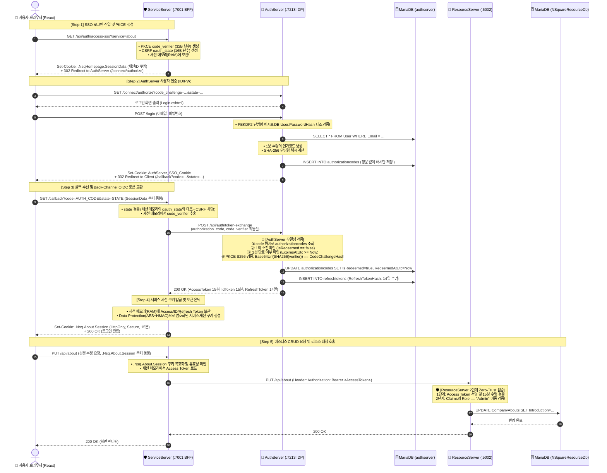

# 🛡️ SSO 인증·인가 파이프라인 및 데이터베이스 설계 종합 명세서
### (Full Architecture, Information Flow & Database Design Specification)

본 문서는 **NSquare Homepage의 전체 SSO/OIDC/BFF/Resource CRUD 파이프라인의 데이터 흐름, 정보 사용 및 보안 검증 메커니즘, 그리고 MariaDB 데이터베이스 스키마 설계**를 총망라한 종합 기술 명세서입니다.

---

## 1. 한눈에 보는 엔드-투-엔드(End-to-End) 전체 시스템 흐름도



---

## 2. 사용자 질의 및 핵심 아키텍처 상세 해설 (Q&A)

### Q1. 서비스 세션 쿠키는 어떻게 생성되고, 어떻게 검증되는가?
* **생성 (`IssueServiceSessionCookieAsync`)**:
  1. 백채널 토큰 교환 성공 시 AuthServer로부터 받은 사용자 정보(`sub`, `email`, `role`, `name`)로 `ClaimsPrincipal` 객체를 구성합니다.
  2. ASP.NET Core `HttpContext.SignInAsync("Cookie_About", principal)`를 호출합니다.
  3. **Data Protection API**가 사용자 신원 데이터를 **AES-256으로 암호화하고 HMAC-SHA256 전자서명을 결합**한 문자열(`CfDJ8...`)로 변환하여 브라우저에 Set-Cookie(`.Nsq.About.Session`, HttpOnly, Secure, SameSite=Lax, 15분 만료)로 내려줍니다.
* **검증 (`CookieAuthenticationMiddleware`)**:
  1. 브라우저가 보낸 쿠키를 ServiceServer의 서버 전용 비밀키로 복호화합니다.
  2. HMAC 서명을 검증하여 **클라이언트가 단 1바이트라도 위조(Tampering)했는지 검사**합니다.
  3. 15분 만료 여부를 확인하고, 정상일 경우 `ClaimsPrincipal`을 복원하여 `HttpContext.User`에 바인딩합니다.

---

### Q2. `code_verifier`와 `state`는 어디에 저장되며, `SessionData` 쿠키는 무엇인가?
* **`SessionData` 쿠키의 실체 (`.NsqHomepage.SessionData`)**:
  * 브라우저에 저장되는 이 쿠키에는 사용자 정보나 토큰이 **전혀 들어있지 않으며, 오직 128비트 임의의 세션 ID 키값**만 들어있습니다.
* **실제 데이터 저장소**:
  * `code_verifier`(32바이트 PKCE 원본 난수)와 `oauth_state`(16바이트 CSRF 방어 난수), 그리고 선택된 서비스명(`target_service`)은 **ServiceServer의 메모리 세션(`DistributedMemoryCache` / RAM)**에만 안전하게 저장됩니다.
* **흐름**:
  * ServiceServer는 `code_verifier`를 S256 해시한 `code_challenge`만 URL에 달아서 브라우저를 AuthServer로 302 리다이렉트(`redirectUrl`)시킵니다.

---

### Q3. 인증서버는 DB를 통해 SSO 쿠키를 어떻게 확인하며, 비밀번호 검증 서버는 어디인가?
* **아이디/비밀번호 검증 주체**: **오직 AuthServer(인증서버)**에서만 수행됩니다.
  * 프론트엔드나 ServiceServer는 사용자의 비밀번호를 절대 보거나 처리하지 않습니다.
  * AuthServer가 `IPasswordHasher<User>`를 사용하여 입력된 평문 비밀번호를 **PBKDF2-SHA256 단방향 암호화**하여 MariaDB `User.PasswordHash`와 대조합니다.
* **SSO 쿠키(`AuthServer_SSO_Cookie`) 확인 원리**:
  * SSO 쿠키 자체를 DB에 저장하지 않습니다.
  * 쿠키는 AuthServer의 Data Protection 키로 암호화되어 브라우저에 보관되며, 사용자가 재방문 시 쿠키를 복호화해 `UserId(sub)`를 꺼낸 뒤 **`User` 테이블에서 사용자가 현재 존재하는지 조회(`SELECT * FROM User WHERE Id = ...`)**하여 세션을 검증합니다.

---

### Q4. 인가코드는 클라이언트에 노출되는가? DB에 얼마나 저장되어야 하는가?
* **클라이언트 노출 여부**:
  * 브라우저 URL 쿼리 스트링(`?code=AUTH_CODE`)으로 약 0.5초간 노출되지만 **완벽히 안전**합니다.
  * **이것이 바로 PKCE(Proof Key for Code Exchange)의 도입 이유**입니다. 공격자가 네트워크 스니핑이나 브라우저 히스토리로 인가 코드를 탈취하더라도, ServiceServer 세션 메모리에만 존재하는 비밀키인 `code_verifier`를 알 수 없으므로 토큰으로 교환할 수 없습니다.
  * ServiceServer는 코드를 받자마자 1초 이내에 토큰으로 교환하고 브라우저 주소창에서 코드를 즉시 삭제(`History.replaceState`)합니다.
* **DB 저장 수명 (Retention)**:
  * **`1분 (60초)` 초단기 수명**.
  * 1회 교환 즉시 `IsRedeemed = true`로 소진 처리되며, 1분이 지나면 만료(`ExpiresAtUtc`)되어 폐기됩니다.
  * MariaDB `authorizationcodes` 테이블에는 평문 코드를 일체 저장하지 않고 **SHA-256 해시(`AuthorizationCodeHash`)만 저장**하므로 DB가 유출되어도 도용이 불가능합니다.

---

### Q5. 인증서버는 해시를 풀어서 검증하는가? (해시 대조의 수학적 원리)
* ⚠️ **암호학적 사실 정정**: 단방향 해시(SHA-256)는 수학적으로 **"역산(풀기/복호화)"이 불가능**합니다.
* **실제 검증 동작 (Match 방식)**:
  1. ServiceServer가 백채널로 `code`와 `code_verifier` 평문을 전송합니다.
  2. AuthServer는 전달받은 `code`를 SHA-256 해시하여 DB의 `AuthorizationCodeHash`와 일치하는 행을 조회합니다.
  3. AuthServer는 전달받은 `code_verifier`를 **$\text{Base64Url}(\text{SHA256}(\text{code\_verifier}))$** 계산 후 한 번 더 해싱하여 DB의 `CodeChallengeHash`와 **일치하는지 대조(Match)**합니다.
  4. 일치하면 즉시 `IsRedeemed = true` 및 `RedeemedAtUtc = DateTime.UtcNow`로 사용 흔적을 영속화합니다.

---

### Q6. 발급된 토큰들의 저장 위치와 서비스 세션 쿠키 발급
* **토큰별 분리 저장**:
  * **`AccessToken` (15분)**: 무상태(Stateless) JWT $\rightarrow$ ServiceServer 세션 메모리(RAM)에 보관
  * **`IdToken` (15분)**: 사용자 신원 증명 JWT $\rightarrow$ ServiceServer 세션 메모리(RAM)에 보관
  * **`RefreshToken` (14일)**: 토큰 회전(Rotation)용 $\rightarrow$ ServiceServer 세션 메모리(RAM) 보관 + **AuthServer의 MariaDB `refreshtokens` 테이블에 해시 영속화**
* **클라이언트 응답**:
  * 토큰을 브라우저에 절대 주지 않고, 암호화된 서비스 세션 쿠키(`.Nsq.About.Session` 등)만 발급하여 XSS 탈취를 완벽히 차단합니다.

---

### Q7. CRUD 요청 시 대행 호출(BFF Proxy) 및 리소스 서버 검증
1. 브라우저가 `PUT /api/about` 요청을 보낼 때 `.Nsq.About.Session` 쿠키가 자동 동봉됩니다.
2. ServiceServer는 쿠키를 복호화해 세션을 식별하고, 세션 메모리에서 `access_token`을 꺼냅니다.
3. ServiceServer는 `Authorization: Bearer <AccessToken>` 헤더를 달아서 ResourceServer(:5002)로 대행 호출합니다.
4. **ResourceServer 검증**:
   * **1단계**: Access Token의 암호학적 전자서명 및 15분 만료시간 검증 (자체 DB에 User 테이블이 없어도 서명으로 100% 검증)
   * **2단계**: 토큰 클레임의 `Role == "Admin"`인지 2차 Zero-Trust 인가 검증
5. ResourceServer가 MariaDB `NSquareResourceDb`에 CRUD를 수행하고 결과를 반환합니다.

---

## 3. MariaDB 데이터베이스 스키마 설계 및 전(全) 컬럼 명세

---

### 🗄️ Database 1: `authserver` (인증 및 토큰 관리 DB)

#### 📋 1. `users` (사용자 마스터 테이블 - BCNF 완전 정규화)
* **테이블 분리 이유**: 장기간 보존되는 핵심 계정 정보로, 잦은 트랜잭션이 발생하는 토큰/로그 테이블과 분리하여 락 경합 방지.

| 컬럼명 | 타입 | 제약조건 | 존재 이유 |
| :--- | :--- | :--- | :--- |
| **`Id`** | `BIGINT` | PK, Auto Inc | 사용자의 불변 고유 식별자 (JWT `sub` 클레임 원천) |
| **`Email`** | `VARCHAR(256)` | Unique Index | 사용자의 로그인 ID (중복 방지 고유 키) |
| **`UserName`** | `VARCHAR(256)` | Not Null | 사용자 표시 이름 (JWT `name` 클레임) |
| **`PasswordHash`** | `LONGTEXT` | Not Null | PBKDF2-SHA256 단방향 비밀번호 암호화 해시 (평문 노출 방지) |
| **`Role`** | `INT` | Not Null | RBAC 권한 Enum (`0=Customer`, `1=Employee`, `2=Admin` / JWT `role` 클레임) |

---

#### 📋 2. `AuthorizationCodeIssuanceLog` (인가 코드 전용 - 초단기 1분 수명 & SHA-256 고정)
* **테이블 분리 및 반정규화 이유**: 1분 수명의 일회용 데이터로 즉시 소진(`IsRedeemed`) 처리됨. 토큰 교환 시 `users` 테이블 JOIN 없이 $O(1)$로 토큰을 만들기 위해 `Subject`, `UserEmail`, `Scope`를 스냅샷 반정규화 보관.
* **SHA-256 고정**: 시스템 자체적으로 SHA-256 단방향 해시 방식을 강제하므로 불필요한 알고리즘 명시 컬럼은 제거하여 경량화.

| 컬럼명 | 타입 | 제약조건 | 존재 이유 |
| :--- | :--- | :--- | :--- |
| **`Id`** | `BIGINT` | PK, Auto Inc | 인가 코드 레코드 식별자 |
| **`AuthorizationCodeHash`** | `VARCHAR(128)` | **Unique Index** | 인가 코드의 SHA-256 해시 (평문 저장 방지, 조회용 키) |
| **`CodeChallengeHash`** | `VARCHAR(128)` | Not Null | PKCE `code_challenge`의 SHA-256 해시 (대조 검증용) |
| **`ClientId`** | `VARCHAR(128)` | Not Null | 인가를 요청한 클라이언트 ID (`company-homepage`) |
| **`RedirectUri`** | `VARCHAR(512)` | Not Null | 인가 완료 콜백 URL (토큰 교환 시 위변조 대조) |
| **`Subject`** | `VARCHAR(128)` | Not Null | 인증된 사용자 ID (반정규화: JWT `sub` 주입용) |
| **`UserEmail`** | `VARCHAR(256)` | Not Null | 사용자 이메일 (반정규화: JWT `email` 주입용) |
| **`Scope`** | `VARCHAR(512)` | Not Null | 승인된 권한 범위 (반정규화: JWT `scope` 주입용) |
| **`CreatedAtUtc`** | `DATETIME(6)` | Index | 인가 코드 발급 일시 |
| **`ExpiresAtUtc`** | `DATETIME(6)` | Index | **인가 코드 만료 일시 (1분 수명)** |
| **`IsRedeemed`** | `TINYINT(1)` | Not Null (기본값: `0`) | **1회용 소진 흔적** (이미 사용된 코드의 재사용 공격 방어) |
| **`RedeemedAtUtc`** | `DATETIME(6)` | Nullable | 토큰 교환이 완료된 시각 |

---

#### 📋 3. `RefreshTokenLedger` (리프레시 토큰 전용 - 장기 14일 수명)
* **테이블 분리 이유**: 인가 코드(1분)와 수명 및 회전(Rotation) 정책이 완전히 다르므로 단독 분리 관리.

| 컬럼명 | 타입 | 제약조건 | 존재 이유 |
| :--- | :--- | :--- | :--- |
| **`Id`** | `BIGINT` | PK, Auto Inc | 리프레시 토큰 식별자 |
| **`RefreshTokenHash`** | `VARCHAR(128)` | **Unique Index** | Refresh Token의 SHA-256 해시 (평문 저장 방지) |
| **`Subject`** | `VARCHAR(128)` | Index | 토큰 소유 사용자 ID (`users.Id`) |
| **`UserEmail`** | `VARCHAR(256)` | Not Null | 사용자 이메일 (반정규화: 재발급 시 User 재조회 생략) |
| **`ClientId`** | `VARCHAR(128)` | Not Null | 서비스 식별자 (`company-homepage`) |
| **`Scope`** | `VARCHAR(512)` | Not Null | 승인된 스코프 |
| **`CreatedAtUtc`** | `DATETIME(6)` | Index | 발급 일시 |
| **`ExpiresAtUtc`** | `DATETIME(6)` | Index | **만료 일시 (기본 14일 수명)** |
| **`IsRevoked`** | `TINYINT(1)` | Not Null (기본값: `0`) | **강제 폐기 여부** (로그아웃 또는 Token Rotation 시 `1`로 전환) |
| **`RevokedAtUtc`** | `DATETIME(6)` | Nullable | 폐기 일시 |
| **`ReplacedByTokenHash`**| `VARCHAR(128)`| Nullable | **Token Rotation 추적**: 교체 발급된 차기 토큰의 해시 |

---

#### 📋 4. `LoginAuditLog` (로그인 감사 및 침해사고 조사 로그)
* **반정규화 이유**: 미등록 가짜 계정(`hacker@test.com`) 공격 시도도 외래키 오류 없이 기록하고, 사용자 탈퇴 후에도 감사 스냅샷을 원본 보존하기 위해 `UserName`을 문자열로 반정규화.

| 컬럼명 | 타입 | 제약조건 | 존재 이유 |
| :--- | :--- | :--- | :--- |
| **`Id`** | `BIGINT` | PK, Auto Inc | 로그인 로그 식별자 |
| **`UserName`** | `VARCHAR(256)` | Composite Index | 로그인 시도 계정 문자열 |
| **`IpAddress`** | `VARCHAR(45)` | Composite Index | 접속 IP 주소 (공격 발원지 추적) |
| **`Succeeded`** | `TINYINT(1)` | Not Null | 성공 여부 (`1=성공`, `0=실패`) |
| **`AttemptedAtUtc`** | `DATETIME(6)` | Composite Index | 시도 일시 (IP/계정별 분당 실패율 집계용) |

---

#### 📋 5. `IpBlocklist` (IP 차단 방화벽 정책)
* **테이블 분리 이유**: 미들웨어 최상단에서 매 요청마다 독립적으로 초고속 캐싱 및 필터링하기 위함.

| 컬럼명 | 타입 | 제약조건 | 존재 이유 |
| :--- | :--- | :--- | :--- |
| **`Id`** | `INT` | PK, Auto Inc | 차단 레코드 식별자 |
| **`IpAddress`** | `VARCHAR(45)` | Unique Index | 차단할 클라이언트 IP 주소 |
| **`Reason`** | `LONGTEXT` | Nullable | 차단 사유 메모 (예: "Brute Force 공격") |
| **`BlockedAtUtc`** | `DATETIME(6)` | Not Null | 차단 시각 |

---

#### 📋 6. `OpenIddictApplications` (OIDC 신뢰 클라이언트 앱 관리)
* **`RedirectUris` vs `PostLogoutRedirectUris` 분리 이유**:
  * `RedirectUris`: **민감한 인가코드(`?code=...`)가 전송되는 전용 콜백 핸들러 화이트리스트** (코드 탈취 방어).
  * `PostLogoutRedirectUris`: 토큰이 전송되지 않는 **일반 메인/로그인 화면 화이트리스트** (피싱 방어).

| 컬럼명 | 타입 | 성격 | 존재 이유 |
| :--- | :--- | :---: | :--- |
| **`Id`** | `VARCHAR(255)` | PK (GUID) | 프레임워크 내부 대리 키 |
| **`ClientId`** | `VARCHAR(100)` | Unique Key | 클라이언트 식별자 (`company-homepage`) |
| **`ClientType`** | `VARCHAR(50)` | **필수** | `public` 지정 시 시크릿 없이 PKCE 검증으로 분기 |
| **`ClientSecret`** | `LONGTEXT` | 스키마 | Public 클라이언트는 `NULL` 유지 |
| **`RedirectUris`** | `LONGTEXT` (JSON) | **보안 핵심** | **인가 코드 전송 허용 콜백 URL 화이트리스트** |
| **`PostLogoutRedirectUris`**| `LONGTEXT` (JSON)| **보안 핵심** | **로그아웃 후 복귀 허용 일반 URL 화이트리스트** |
| **`Permissions`** | `LONGTEXT` (JSON) | 권한 제어 | 허용 엔드포인트/인가방식/스코프 화이트리스트 |
| **`Requirements`** | `LONGTEXT` (JSON) | 보안 강제 | `features:pkce` (PKCE 미사용 요청 차단) |
| **`ConsentType`** | `VARCHAR(50)` | 정책 | `implicit` (사내 신뢰 앱이라 동의화면 생략) |
| **`HomepageName`**| `LONGTEXT` | **영문 제약 (`CHECK`)** | 클라이언트 영문 명칭 ("Company Homepage" / 한글 차단) |
| **`Properties`** | `LONGTEXT` (JSON) | 확장용 | 개발자 전용 커스텀 메타데이터 가방 |
| **`Settings`** | `LONGTEXT` (JSON) | 엔진 설정 | 토큰 수명 등 엔진 설정 오버라이드 |
| **`ConcurrencyToken`** | `VARCHAR(50)` | 동시성 제어 | 갱신 분실(Lost Update) 방지용 낙관적 락 토큰 |

---

#### 📋 7. `OpenIddictAuthorizations` (사용자 권한 위임 및 인가 승인 이력 관리)
* **테이블 존재 이유**: 사용자가 특정 클라이언트 앱에 권한 범위를 위임(동의)한 내역을 영속화하여, 중복 동의 생략 및 전역 로그아웃/권한 철회(Revoke)를 추적 관리.

| 컬럼명 | 타입 | 성격 | 존재 이유 |
| :--- | :--- | :---: | :--- |
| **`Id`** | `VARCHAR(255)` | PK (GUID) | 인가 승인 식별자 |
| **`Subject`** | `VARCHAR(255)` | Index | 권한을 위임한 사용자 ID (`users.Id`) |
| **`ApplicationId`** | `VARCHAR(255)` | FK/Index | 권한을 위임받은 클라이언트 앱 ID (`OpenIddictApplications.Id`) |
| **`Scopes`** | `LONGTEXT` (JSON) | 승인 스코프 | 위임 승인된 스코프 목록 (`["openid", "email", "roles"]`) |
| **`Status`** | `VARCHAR(50)` | 상태 | 인가 유효 상태 (`valid`, `revoked`) |
| **`Type`** | `VARCHAR(50)` | 유형 | 인가 지속 유형 (`permanent`, `adhoc`) |
| **`CreationDate`** | `DATETIME(6)` | 승인 일시 | 최초 인가 승인 일시 |
| **`Properties`** | `LONGTEXT` (JSON) | 확장용 | 추가 커스텀 메타데이터 |
| **`ConcurrencyToken`** | `VARCHAR(50)` | 동시성 제어 | 낙관적 락 토큰 |

---

#### 📋 8. `OpenIddictScopes` (인가 스코프 정의 및 카탈로그 관리)
* **테이블 존재 이유**: 시스템에 정의된 권한 범위(Scope)의 명칭, 설명 문구, 대상 리소스 서버(Audience) 메타데이터를 등록·관리.
* **영문 통일 및 중복 제거**: `DisplayName`과 `Description`은 영문 전용(`CHECK` 제약)으로 관리하며, 불필요한 다국어 JSON 컬럼 `DisplayNames`와 `Descriptions`는 제거.

| 컬럼명 | 타입 | 성격 | 존재 이유 |
| :--- | :--- | :---: | :--- |
| **`Id`** | `VARCHAR(255)` | PK (GUID) | 스코프 레코드 식별자 |
| **`Name`** | `VARCHAR(200)` | **Unique Key** | 스코프 고유 식별자 (`openid`, `profile`, `email` 등) |
| **`DisplayName`** | `LONGTEXT` | **영문 제약 (`CHECK`)** | 동의 화면 노출용 영문 표시 명칭 (한글 차단) |
| **`Description`** | `LONGTEXT` | **영문 제약 (`CHECK`)** | 영문 상세 설명 안내 문구 (한글 차단) |
| **`Resources`** | `LONGTEXT` (JSON) | 대상 리소스 | 이 스코프가 유효한 리소스 서버 URL 목록 (`aud` 자동 주입) |
| **`Properties`** | `LONGTEXT` (JSON) | 확장용 | 추가 커스텀 메타데이터 |
| **`ConcurrencyToken`** | `VARCHAR(50)` | 동시성 제어 | 낙관적 락 토큰 |

---

#### 📋 9. `OpenIddictTokens` (OIDC 프레임워크 내부 토큰 아티팩트 저장소 - `DisableTokenStorage()` 적용)
* **테이블 존재 이유 및 운영 정책**: OpenIddict 기본 스키마 테이블이나, 불필요한 2중 저장 방지 및 성능 최적화를 위해 `options.DisableTokenStorage()`가 적용되었습니다. 인가 코드는 `AuthorizationCodeIssuanceLog`, 리프레시 토큰은 `RefreshTokenLedger`에서 전담 관리합니다.

| 컬럼명 | 타입 | 성격 | 존재 이유 |
| :--- | :--- | :---: | :--- |
| **`Id`** | `VARCHAR(255)` | PK (GUID) | 토큰 레코드 식별자 |
| **`Type`** | `VARCHAR(50)` | 토큰 종류 | `authorization_code`, `refresh_token`, `access_token` |
| **`Subject`** | `VARCHAR(400)` | 사용자 식별자 | 토큰 소유 사용자 ID (`users.Id`) |
| **`ApplicationId`** | `VARCHAR(255)` | 클라이언트 | 대상 클라이언트 앱 ID (`OpenIddictApplications.Id`) |
| **`AuthorizationId`** | `VARCHAR(255)` | 부모 인가 | 연결된 인가 승인 ID (`OpenIddictAuthorizations.Id`) |
| **`Payload`** | `LONGTEXT` | 암호화 본문 | 암호화된 토큰 클레임 및 메타데이터 |
| **`Status`** | `VARCHAR(50)` | 상태 | 토큰 상태 (`valid`, `redeemed`, `revoked`) |
| **`CreationDate`** | `DATETIME(6)` | 발급 일시 | 토큰 생성 시각 |
| **`ExpirationDate`** | `DATETIME(6)` | 만료 일시 | 토큰 유효기간 만료 시각 |
| **`RedemptionDate`** | `DATETIME(6)` | 소진 일시 | 인가 코드가 토큰으로 교환된 시각 |
| **`ReferenceId`** | `VARCHAR(100)` | 검색 키 | 토큰 검색용 식별 해시 |
| **`Properties`** | `LONGTEXT` (JSON) | 확장용 | 추가 커스텀 메타데이터 |
| **`ConcurrencyToken`** | `VARCHAR(50)` | 동시성 제어 | 낙관적 락 토큰 |

---

### 🗄️ Database 2: `NSquareResourceDb` (비즈니스 리소스 DB)

인증 서버와 물리적으로 완전히 분리된 리소스 전용 데이터베이스입니다.

#### 📋 1. `CompanyAbouts` (회사 소개)
* **`Id`** (`INT` PK) : 소개 레코드 식별자
* **`Introduction`** (`VARCHAR(4000)`) : 회사 소개 본문 내용
* **`UpdatedAt`** (`DATETIME(6)`) : 최종 수정 일시

#### 📋 2. `CompanyServices` (주요 서비스)
* **`Id`** (`INT` PK) : 서비스 레코드 식별자
* **`Service`** (`VARCHAR(4000)`) : 제공 서비스 상세 내역
* **`UpdatedAt`** (`DATETIME(6)`) : 최종 수정 일시

#### 📋 3. `CompanyHistories` (회사 연혁)
* **`Id`** (`INT` PK) : 연혁 레코드 식별자
* **`Date`** (`DATE`) : 연혁 발생 일자 (YYYY-MM-DD)
* **`Content`** (`VARCHAR(1000)`) : 주요 성과 및 연혁 내용
* **`CreatedAt`** (`DATETIME(6)`) : 등록 일시

---

## 4. 인덱스 및 성능 최적화 매트릭스

```sql
-- [authserver DB]
ALTER TABLE `users` ADD UNIQUE INDEX `UX_users_Email` (`Email`);
ALTER TABLE `IpBlocklist` ADD UNIQUE INDEX `UX_IpBlocklist_IpAddress` (`IpAddress`);
ALTER TABLE `LoginAuditLog` ADD INDEX `IX_LoginAuditLog_AttemptedAtUtc` (`AttemptedAtUtc`);
ALTER TABLE `LoginAuditLog` ADD INDEX `IX_LoginAuditLog_IpAddress_AttemptedAtUtc` (`IpAddress`, `AttemptedAtUtc`);
ALTER TABLE `LoginAuditLog` ADD INDEX `IX_LoginAuditLog_UserName_AttemptedAtUtc` (`UserName`, `AttemptedAtUtc`);
ALTER TABLE `AuthorizationCodeIssuanceLog` ADD UNIQUE INDEX `UX_AuthorizationCodeIssuanceLog_AuthorizationCodeHash` (`AuthorizationCodeHash`);
ALTER TABLE `AuthorizationCodeIssuanceLog` ADD INDEX `IX_AuthorizationCodeIssuanceLog_ExpiresAtUtc` (`ExpiresAtUtc`);
ALTER TABLE `RefreshTokenLedger` ADD UNIQUE INDEX `UX_RefreshTokenLedger_RefreshTokenHash` (`RefreshTokenHash`);
ALTER TABLE `RefreshTokenLedger` ADD INDEX `IX_RefreshTokenLedger_Subject` (`Subject`);
ALTER TABLE `RefreshTokenLedger` ADD INDEX `IX_RefreshTokenLedger_ExpiresAtUtc` (`ExpiresAtUtc`);
ALTER TABLE `OpenIddictAuthorizations` ADD INDEX `IX_OpenIddictAuthorizations_Subject` (`Subject`);
ALTER TABLE `OpenIddictAuthorizations` ADD INDEX `IX_OpenIddictAuthorizations_ApplicationId` (`ApplicationId`);
ALTER TABLE `OpenIddictTokens` ADD INDEX `IX_OpenIddictTokens_Subject` (`Subject`);
ALTER TABLE `OpenIddictTokens` ADD INDEX `IX_OpenIddictTokens_ReferenceId` (`ReferenceId`);

-- [NSquareResourceDb DB]
ALTER TABLE `CompanyAbouts` ADD PRIMARY KEY (`Id`);
ALTER TABLE `CompanyServices` ADD PRIMARY KEY (`Id`);
ALTER TABLE `CompanyHistories` ADD PRIMARY KEY (`Id`);
```
