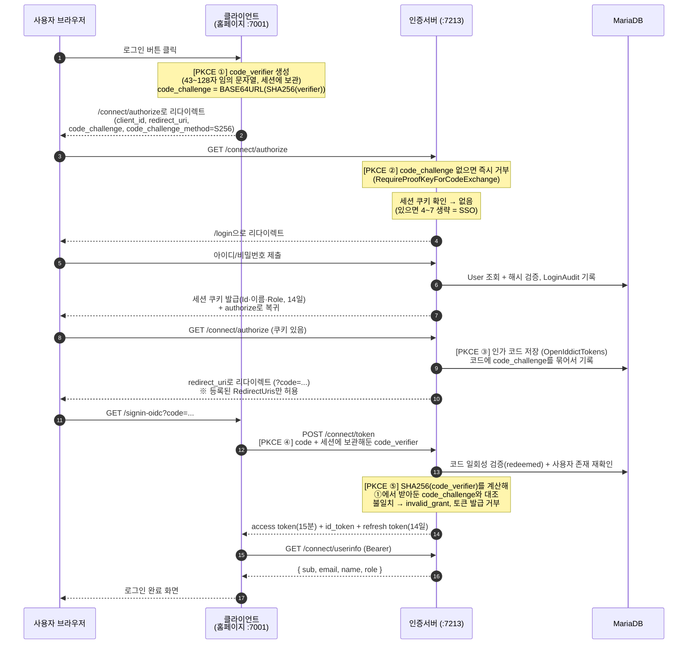

# AuthServer — 사내 통합 인증 서버 (SSO)

회사 홈페이지 등 여러 사내 서비스가 **한 번의 로그인을 공유(SSO)** 하도록 하는
OpenID Connect(OIDC) 인증 서버.

| 항목 | 내용 |
|---|---|
| 런타임 | .NET 10 / ASP.NET Core |
| OIDC 프로토콜 | OpenIddict 6 (Authorization Code + PKCE, Refresh Token) |
| DB | MariaDB 12.2 (Pomelo EF Core 프로바이더) |
| 인증 방식 | ASP.NET Core 기본 부품(쿠키 인증 + PasswordHasher)을 직접 조합 — 상위 프레임워크인 ASP.NET Identity(UserManager/SignInManager)는 미사용 |
| 스키마 관리 | `EnsureCreated` (마이그레이션 없음) |

---

## 1. 프로젝트 구조

Clean Architecture 4계층. 의존 방향은 항상 아래(안쪽)로만 향한다:
`Web → Infrastructure → Application → Domain`

```
src/
├── Domain/                              # 가장 안쪽. 아무것도 참조하지 않는 순수 엔티티
│   └── Entities/
│       ├── User.cs                      # 사용자 + UserRole enum
│       ├── LoginLog.cs                  # 로그인 시도 기록 (loginlog)
│       └── BlockedIp.cs                 # 차단 IP
│
├── Application/                         # 업무 규칙. Domain만 참조
│   ├── Interfaces/
│   │   ├── IUserService.cs              # "사용자를 만든다" 포트 (구현은 Infrastructure)
│   │   └── ILoginAuditor.cs             # "시도를 기록한다" 포트
│   └── UseCases/
│       └── RegisterUserUseCase.cs       # 가입 입력 검증 → IUserService에 위임
│
├── Infrastructure/                      # 기술 구현. DB·해싱이 여기에만 존재
│   ├── Persistence/AppDbContext.cs      # EF Core 매핑 (테이블명·컬럼 길이·인덱스)
│   ├── Services/UserService.cs          # 중복 검사 + 비밀번호 해싱 + 저장
│   ├── Services/LoginAuditor.cs         # loginlog 행 추가
│   └── DependencyInjection.cs           # 조립: DbContext, OpenIddict Core, PasswordHasher
│
└── Web/                                 # HTTP 계층 (진입점)
    ├── Program.cs                       # 파이프라인 구성, 쿠키 인증, OpenIddict 서버, API
    ├── SeedData.cs                      # 시작 시 스키마 생성 + 클라이언트/테스트 계정 시드
    ├── Pages/Login.cshtml(.cs)          # 로그인 화면 — 비밀번호 검증을 직접 수행
    ├── Controllers/AuthorizationController.cs   # OIDC 엔드포인트 4개
    └── Middleware/IpBlockMiddleware.cs  # 차단 IP 검사 (1분 캐시)

tests/
└── Application.Tests/                   # 가입 유스케이스 단위 테스트 (xUnit)
```

**계층을 나눈 이유**: 업무 규칙(Application)이 "DB가 MariaDB인지, 해싱이 뭔지"를
모르게 하기 위해서다. `RegisterUserUseCase`는 `IUserService`라는 인터페이스만 알고,
실제 EF Core 구현은 Infrastructure에 있다. 덕분에 테스트에서 가짜 구현(Fake)을
꽂아 DB 없이 업무 규칙만 검증할 수 있다.

---

## 2. 인증 원리

### 2-1. 비밀번호는 해시로만 저장

평문 비밀번호는 어디에도 저장하지 않는다. 가입 시 ASP.NET Core의
`PasswordHasher<User>`(PBKDF2 알고리즘, 솔트 자동 포함)로 해시를 만들어
`User.PasswordHash`에 저장하고, 로그인 시 입력값을 같은 방식으로 검증한다.
DB가 통째로 유출돼도 원문 비밀번호는 복원할 수 없다.

### 2-2. 인증 서버 세션 = 쿠키

로그인에 성공하면 사용자 정보를 담은 **암호화된 쿠키**를 발급한다(14일 유지).
쿠키에는 클레임(key-value) 3개가 들어간다:

| 클레임 | 값 | 용도 |
|---|---|---|
| `NameIdentifier` | User.Id | 누구인지 (매 요청마다 이걸로 DB 조회 가능) |
| `Name` | UserName | 표시 이름 |
| `Role` | "Admin" 등 | `[Authorize(Roles = "Admin")]` 판정용. **발급 시점 역할로 고정** |

이 쿠키가 곧 "인증 서버에 로그인돼 있음"의 증거이고, SSO의 재료다.

### 2-3. SSO 원리 — Authorization Code + PKCE

클라이언트(홈페이지)는 사용자 비밀번호를 절대 만지지 않는다. 대신:

1. 클라이언트가 사용자를 인증 서버의 `/connect/authorize`로 보낸다.
2. 인증 서버가 자기 쿠키를 확인한다.
   - **쿠키 없음** → 로그인 화면. 성공하면 쿠키 발급 후 계속.
   - **쿠키 있음** → 로그인 화면 생략하고 즉시 통과. ← **이게 SSO**
3. 일회용 **인가 코드**를 붙여 클라이언트로 돌려보낸다.
4. 클라이언트가 코드를 `/connect/token`에 제출해 토큰으로 교환한다.

**PKCE**: 3번의 코드가 탈취될 수 있으므로, 클라이언트는 처음에 임의값의 해시
(`code_challenge`)를 보내고 4번에서 원본(`code_verifier`)을 제출한다. 원본을
모르는 공격자는 코드를 주워도 토큰으로 바꿀 수 없다. 이 서버는 PKCE를 **강제**한다.

### 2-4. 쿠키는 두 종류다 — BFF 패턴

이 구조에는 성격이 다른 쿠키가 **두 개** 존재한다. 혼동하면 보안 분석이 틀어진다.

| | 인증 서버 세션 쿠키 | 서비스(클라이언트) 세션 쿠키 |
|---|---|---|
| 발급자 | 인증 서버 (:7213) | 각 서비스 서버 (예: :7001) |
| 도메인 스코프 | 인증 서버 도메인에만 전송 | 해당 서비스 도메인에만 전송 |
| 의미 | "인증 서버에 로그인돼 있음" — **SSO의 실체** | "이 서비스의 세션" — 서버측에 보관된 토큰 묶음과 1:1 매핑 |
| 탈취 시 피해 | 모든 서비스에 **새로 SSO 로그인 가능** (치명적) | **그 서비스 하나**로 국소화 (다른 서비스엔 쿠키 자체가 전송 안 됨) |

**BFF(Backend For Frontend) 패턴**: access/refresh 토큰은 브라우저로 절대 나가지
않고 서비스 서버 안에만 보관한다. 브라우저에는 HttpOnly 세션 쿠키만 준다.

- 토큰이 브라우저에 없으므로 XSS로 refresh token을 훔칠 대상이 없다
  (localStorage에 JWT를 두는 방식의 최대 약점이 원천 제거됨)
- access token 만료 시 서비스 서버가 보관 중인 refresh token으로 **백채널에서
  조용히 갱신** — 브라우저는 같은 쿠키만 계속 제시하면 된다
- 세션이 서버측 상태이므로 즉시 강제 종료 가능 (무상태 JWT는 만료까지 유효)

단, 쿠키는 소지자 증명(bearer)이다 — 쿠키를 쥔 자를 서버는 본인과 구분할 수
없다. 그래서 HttpOnly(XSS 차단)·Secure(도청 차단)·SameSite(CSRF 차단)로
탈취 경로 자체를 줄이는 것이 방어의 전부다.

**토큰은 서비스마다 각자 발급된다.** "모든 서비스가 공유하는 토큰"은 존재하지
않는다 — 각 서비스가 자기 client_id로 authorize를 돌아 자기 몫의 토큰을 받는다.
서비스 간에 공유되는 것은 오직 인증 서버의 세션 쿠키(위 표의 왼쪽)뿐이고,
그것이 SSO의 전부다.

### 2-5. 토큰 수명 설계

| 토큰 | 수명 | 역할 |
|---|---|---|
| access token | **15분** | API 호출용. 짧게 잡아 탈취 피해를 제한 |
| id_token | (일회성) | "누가 로그인했나" — sub·name·email·role 클레임 포함 |
| refresh token | **14일** | access token 재발급용. 갱신 때마다 사용자 존재를 DB에서 재확인 |

역할 변경·탈퇴는 다음 토큰 갱신 시점(최대 15분)에 반영된다.

---

## 3. 동작 과정

### 3-1. 서버 시작 시 (`SeedData` — IHostedService)

1. `EnsureCreatedAsync()` — DB/테이블이 없으면 현재 모델대로 생성 (있으면 아무것도 안 함)
2. trustedApplication에 `company-homepage` 클라이언트가 없으면 등록
   (redirect URI, PKCE 필수, 허용 grant/scope 포함)
3. **개발 환경이면** 테스트 계정 시드: `test@company.local` / `Test1234!` / Admin

### 3-2. 매 요청 파이프라인 (Program.cs 등록 순서대로)

```
HTTPS 리다이렉트
→ IpBlockMiddleware      # BlockedIp 테이블 검사. 1분 메모리 캐시로 DB 조회 절약
→ RateLimiter            # IP당 분당 60회 초과 시 429
→ CORS                   # appsettings의 AllowedOrigins만 허용
→ UseAuthentication      # 쿠키/토큰 → ClaimsPrincipal 복원
→ UseAuthorization       # [Authorize] 판정
→ 라우팅 (페이지/컨트롤러/API)
```

### 3-3. SSO 로그인 전체 시퀀스

> draw.io로 편집 가능한 원본: [`../docs/auth-flow.drawio`](../docs/auth-flow.drawio)
> (아래 다이어그램은 GitHub/VS Code에서 자동 렌더링됩니다)



**PKCE 단계별 정리 (다이어그램의 ①~⑤)**

| 단계 | 어디서 | 무슨 일 |
|---|---|---|
| ① 생성 | 클라이언트 | `code_verifier`(임의 문자열)를 만들어 **자기 세션에만** 보관하고, 그 SHA-256 해시(`code_challenge`)만 네트워크로 보낸다 |
| ② 강제 | 인증 서버 `/connect/authorize` | `code_challenge` 없는 요청은 거부. 서버 전역(`Program.cs`의 `RequireProofKeyForCodeExchange`) + 클라이언트 등록(`SeedData.cs`의 `Requirements.Features.ProofKeyForCodeExchange`) 이중으로 강제 |
| ③ 보관 | 인증 서버 → DB | 인가 코드를 저장할 때 `code_challenge`를 코드에 묶어둔다 — "이 코드는 이 해시의 주인만 쓸 수 있음" |
| ④ 제출 | 클라이언트 `/connect/token` | 코드와 함께 원본 `code_verifier`를 제출 |
| ⑤ 검증 | 인증 서버 | `SHA256(code_verifier) == 저장된 code_challenge`인지 대조. 불일치면 `invalid_grant` — 토큰 미발급 |

**원리**: 코드는 브라우저 리다이렉트(URL)로 오가므로 탈취될 수 있지만,
`code_verifier` 원본은 클라이언트 세션 밖으로 나간 적이 없다. 해시는 역산이
불가능하므로, ②에서 `code_challenge`를 훔쳐본 공격자도 ④에서 제출할 원본을
만들 수 없다 — **코드만 주워서는 토큰으로 바꿀 수 없다.** 이 검증(②·⑤)은
OpenIddict가 프로토콜 수준에서 자동 수행하며, 이 서버의 역할은 두 곳의 설정으로
그것을 "필수"로 만든 것이다.

**A 서비스 로그인 후 B 서비스 접속 (SSO 동작)**: B도 위 시퀀스를 **처음부터
전부** 밟는다 — 자기 code_verifier 생성, 자기 client_id로 authorize, 자기 몫의
토큰 교환, 자기 세션 쿠키 발급까지. 다른 점은 단 하나: 3번에서 인증 서버가
A 로그인 때 발급해둔 자기 세션 쿠키를 발견하므로 **로그인 화면(4~7)만 건너뛴다.**
나머지는 전부 리다이렉트로 자동 진행되어 사용자 눈에는 "그냥 로그인돼 있음"으로
보인다. A의 토큰을 B가 넘겨받는 것이 아니다.

`/connect/logout`은 인증 서버 세션 쿠키를 삭제한다 → 이후 모든 서비스의
authorize가 로그인 화면으로 떨어진다 (SSO 전체 해제).

**redirect_uri(콜백 주소)의 양쪽 역할**: 콜백 페이지 자체는 클라이언트에 존재하고,
클라이언트가 요청 시 `redirect_uri` 파라미터로 지정한다. 인증 서버는 이를
`trustedApplication.RedirectUris` 화이트리스트와 대조해 **목록에 없으면 거부**한다
— 공격자가 코드를 자기 서버로 빼돌리는 것을 막는 장치.

### 3-4. 회원가입 — `POST /api/register`

```
{ email, userName, password }
→ RegisterUserUseCase: 빈 값 검사 (이메일 형식 검증은 하지 않음 — 아이디처럼 사용 가능)
→ UserService: 8자 이상 확인 → Email 중복 조회 → 해싱 → INSERT
                (동시 가입 경합은 Email 유니크 인덱스가 최종 방어)
→ Role은 항상 Customer로 시작
```

### 3-5. 역할 변경 — `PUT /api/users/{id}/role` (관리자 전용)

```
Body: { "role": 0 | 1 | 2 }
→ 호출자 쿠키에서 Id 추출 → DB에서 현재 역할 재확인 (쿠키의 Role 클레임을 믿지 않음)
   ※ 강등된 관리자가 남은 쿠키로 호출하는 것을 차단하기 위해 DB를 본다
→ Admin이면 대상 사용자의 Role 갱신
응답: 200 성공 / 400 잘못된 역할값 / 401 미로그인 / 403 관리자 아님 / 404 대상 없음
```

---

## 4. 테이블 상세 (9개)

### users — 사용자 마스터

| 컬럼 | 타입 | 하는 일 |
|---|---|---|
| `Id` | bigint, PK, 자동증가 | 사용자 고유 번호. OIDC 토큰의 `sub` 클레임으로 나감 |
| `Email` | varchar(256), **유니크** | **로그인 ID**. 이메일 형식 강제 안 함(아이디처럼 사용 가능). 유니크 인덱스가 중복 가입의 최종 방어선 |
| `UserName` | varchar(256) | 표시 이름. 토큰의 `name` 클레임으로 나감 |
| `PasswordHash` | longtext | PBKDF2 해시(솔트 포함). 평문 저장 안 함 |
| `Role` | int | 역할 enum: `0=Customer(고객, 가입 기본값)` `1=Employee(직원)` `2=Admin(관리자)`. **숫자가 DB에 저장되므로 enum 멤버의 번호를 나중에 바꾸면 안 됨** (새 역할은 뒤 번호로 추가) |

### AuthorizationCodeIssuanceLog — 인가 코드 발급 및 1회용 소진 원장

1분 수명의 일회용 인가 코드 해시 및 스냅샷 저장소. 토큰 교환 즉시 `IsRedeemed = 1`로 소진 처리.

| 컬럼 | 타입 | 하는 일 |
|---|---|---|
| `Id` | bigint, PK, 자동증가 | 인가 코드 발급 식별자 |
| `AuthorizationCodeHash` | varchar(128), **유니크** | 인가 코드 SHA-256 해시 (평문 미저장) |
| `CodeChallengeHash` | varchar(128) | PKCE `code_challenge` SHA-256 해시 (토큰 교환 시 대조) |
| `ClientId` / `RedirectUri` | varchar | 인가 요청 클라이언트 및 콜백 URL |
| `Subject` / `UserEmail` / `Scope` | varchar | 사용자 ID, 이메일, 스코프 스냅샷 |
| `CreatedAtUtc` / `ExpiresAtUtc` | datetime(6) | 발급 일시 및 1분 만료 시각 |
| `IsRedeemed` / `RedeemedAtUtc` | tinyint(1) / datetime(6) | 1회용 소진 플래그 및 교환 완료 시각 |

### RefreshTokenLedger — 리프레시 토큰 관리 원장

14일 수명의 리프레시 토큰 해시 원장. Token Rotation 정책 적용.

| 컬럼 | 타입 | 하는 일 |
|---|---|---|
| `Id` | bigint, PK, 자동증가 | 토큰 식별자 |
| `RefreshTokenHash` | varchar(128), **유니크** | Refresh Token SHA-256 해시 |
| `Subject` / `UserEmail` | varchar | 소유 사용자 ID 및 이메일 |
| `ClientId` / `Scope` | varchar | 대상 클라이언트 및 스코프 |
| `CreatedAtUtc` / `ExpiresAtUtc` | datetime(6) | 발급 일시 및 14일 만료 시각 |
| `IsRevoked` / `RevokedAtUtc` | tinyint(1) / datetime(6) | 폐기 플래그 및 폐기 시각 |
| `ReplacedByTokenHash` | varchar(128) | 교체 발급된 차기 토큰 해시 (회전 추적) |

### LoginAuditLog — 로그인 시도 감사 기록

성공/실패 모든 시도가 기록된다. 침입 시도 추적·계정 잠금 도입 시 근거 데이터.

| 컬럼 | 타입 | 하는 일 |
|---|---|---|
| `Id` | bigint, PK, 자동증가 | |
| `UserName` | varchar(256) | 시도한 로그인 ID (존재하지 않는 계정 입력도 그대로 기록됨) |
| `IpAddress` | varchar(45) | 요청 IP. 45자 = IPv6 최대 길이. 로컬 접속은 `::1`(IPv6 루프백)로 찍힘 |
| `Succeeded` | tinyint(1) | 성공 여부 |
| `AttemptedAtUtc` | datetime(6), 인덱스 | 시도 시각(UTC). 기간 조회용 인덱스 |

### IpBlocklist — 차단 IP (수동 운영 테이블)

행을 넣으면 그 IP의 모든 요청이 403. **자동 차단/자동 해제 없음** — 운영자가
직접 넣고 뺀다. 미들웨어가 1분 캐시로 검사하므로 반영이 최대 1분 늦다.

| 컬럼 | 타입 | 하는 일 |
|---|---|---|
| `Id` | int, PK, 자동증가 | |
| `IpAddress` | varchar(45), **유니크** | 차단할 IP |
| `Reason` | longtext, null 허용 | 차단 사유 메모 |
| `BlockedAtUtc` | datetime(6) | 차단 시각 |

### OpenIddictApplications — 등록된 클라이언트

이 서버를 사용할 수 있는 앱의 목록. 여기 없는 client_id는 authorize 요청 자체가 거부된다.

| 주요 컬럼 | 하는 일 |
|---|---|
| `ClientId` | 클라이언트 식별자 (`company-homepage`) |
| `ClientType` | `public` — 브라우저 앱은 시크릿을 숨길 수 없어 PKCE로 보호 |
| `ClientSecret` | public 클라이언트라 null |
| `RedirectUris` | 인가 코드를 돌려보낼 수 있는 주소 목록(JSON). **이 목록 밖으로는 절대 리다이렉트하지 않음** — 코드 탈취 방지의 핵심 |
| `PostLogoutRedirectUris` | 로그아웃 후 복귀 허용 주소 |
| `Permissions` | 허용된 엔드포인트·grant type·scope (JSON) |
| `Requirements` | PKCE 필수 등 요구사항 |
| `HomepageName` | 클라이언트 영문 명칭 (영문 `CHECK` 제약 적용) |

### OpenIddictAuthorizations — 인가 기록

"사용자 X가 클라이언트 Y에 로그인을 허락했다"는 사실. 토큰들의 부모 격으로,
인가 단위로 관련 토큰을 한꺼번에 폐기할 수 있다.

| 주요 컬럼 | 하는 일 |
|---|---|
| `ApplicationId` (FK) | 어느 클라이언트에 대한 인가인지 |
| `Subject` | 사용자 Id (문자열) |
| `Scopes` | 허락된 범위 (openid, email, profile, offline_access) |
| `Status` / `Type` / `CreationDate` | 유효 상태, 인가 유형, 생성 시각 |

### OpenIddictTokens — 발급 토큰 원장

인가 코드와 refresh token의 서버측 기록. **"코드는 한 번만 사용"을 강제하는 근거.**

| 주요 컬럼 | 하는 일 |
|---|---|
| `ApplicationId` / `AuthorizationId` (FK) | 소속 클라이언트·인가 |
| `Subject` | 사용자 Id |
| `Type` | `authorization_code` / `refresh_token` |
| `Status` | `valid` → `redeemed`(사용됨) / `revoked`(폐기). 사용된 코드 재제출 시 거부 |
| `CreationDate` / `ExpirationDate` / `RedemptionDate` | 수명 추적 |
| `Payload` | 토큰 본문(암호화) |

### OpenIddictScopes — 인가 스코프 정의

시스템에 정의된 권한 범위의 명칭, 설명, 대상 리소스 서버 목록. `DisplayName`, `Description` 영문 `CHECK` 제약 적용.

---

## 5. HTTP 엔드포인트 목록

| 메서드/경로 | 인증 | 하는 일 |
|---|---|---|
| `GET/POST /login` | - | 로그인 화면. 성공 시 쿠키 발급 |
| `GET/POST /connect/authorize` | 쿠키 | SSO 진입점. 세션 확인 → 인가 코드 발급 |
| `POST /connect/token` | 코드/refresh | 토큰 교환·갱신 |
| `GET /connect/userinfo` | Bearer 토큰 | `{ sub, email, name, role }` 반환 |
| `GET/POST /connect/logout` | 쿠키 | 세션 종료 (SSO 전체 해제) |
| `POST /api/register` | - | 회원가입 (Role=Customer) |
| `PUT /api/users/{id}/role` | 쿠키 + Admin(DB 확인) | 역할 변경 |
| `GET /swagger` | - (개발 전용) | API 문서 |

---

## 6. 보안 장치 요약

| 위협 | 대응 |
|---|---|
| 비밀번호 유출 | PBKDF2 해시 저장 (PasswordHasher) |
| 인가 코드 탈취 | PKCE 강제 + 코드 일회성(redeemed 추적) + RedirectUris 화이트리스트 |
| 토큰 탈취 | access token 15분 단명 |
| brute force | IP당 분당 60회 레이트리밋 + 전 시도 LoginAudit 기록 |
| 악성 IP | BlockedIp 테이블 (수동, 1분 캐시) |
| CSRF | 로그인 폼 antiforgery 토큰, API는 SameSite=Lax 쿠키 |
| 권한 상승 | 민감 API(역할 변경)는 쿠키 클레임이 아닌 DB의 현재 역할로 판정 |
| 탈퇴자 토큰 갱신 | /connect/token에서 매번 사용자 존재 재확인 |

---

## 7. 개발 환경

### 실행

```powershell
dotnet run --project src\Web --launch-profile https     # 또는 VS F5
# → https://localhost:7213
```

**반드시 https 프로필로 실행해야 한다.** OpenIddict 서버는 기본적으로 HTTP 요청을
거부하므로(에러 ID2083), http(:5123)로 띄우면 디스커버리부터 전부 400이 떨어져
클라이언트 로그인이 동작하지 않는다.

접속 정보는 `src/Web/appsettings.json`의 `ConnectionStrings:Default`.
(현재 root 계정이 하드코딩돼 있음 — 커밋 전 User Secrets로 이동 권장)

### 테스트 계정 (개발 환경 자동 시드)

| 아이디 | 비밀번호 | 역할 |
|---|---|---|
| `test@company.local` | `Test1234!` | Admin |

### 단위 테스트

```powershell
dotnet test
```

### 엔티티(스키마) 변경 시

마이그레이션이 없으므로 **DB를 지우고 재생성**해야 반영된다:

```powershell
dotnet ef database drop --force --project src\Infrastructure --startup-project src\Web
# 이후 앱 실행하면 SeedData가 새 스키마로 자동 생성
```

---

## 8. 의도적으로 미룬 것들 (코드의 `ponytail:` 주석과 대응)

| 항목 | 현재 상태 | 언제 바꿀 것 |
|---|---|---|
| 서명/암호화 인증서 | 개발용 자동 생성 | **운영 배포 전 필수** — 실제 인증서 파일로 교체 |
| 스키마 관리 | EnsureCreated (드랍 후 재생성) | 운영에서 데이터 보존하며 스키마 변경이 필요해질 때 마이그레이션으로 전환 |
| 동의(consent) 화면 | 없음 (사내 신뢰 클라이언트 자동 동의) | 외부 클라이언트를 받을 때 |
| 계정 잠금 | 없음 (레이트리밋+감사 로그로 대체) | 필요 시 LoginAudit 실패 횟수 기반으로 추가 |
| IP 자동 차단/해제 | 수동 운영 | 필요 시 ExpiresAtUtc 컬럼 + 자동 등록 로직 추가 |
| 비밀번호 변경 시 세션 무효화 | 없음 (SecurityStamp 제거됨) | 비밀번호 변경 기능을 만들 때 함께 구현 |
| 리버스 프록시 대응 | 없음 (`RemoteIpAddress` 직접 사용) | 프록시 뒤 배포 시 `UseForwardedHeaders` 추가 (안 하면 IP 기록·차단·레이트리밋 무력화) |
| 테스트 클라이언트 | 없음 | SSO 전체 흐름 테스트가 필요하면 7001 포트 최소 클라이언트 제작 |
