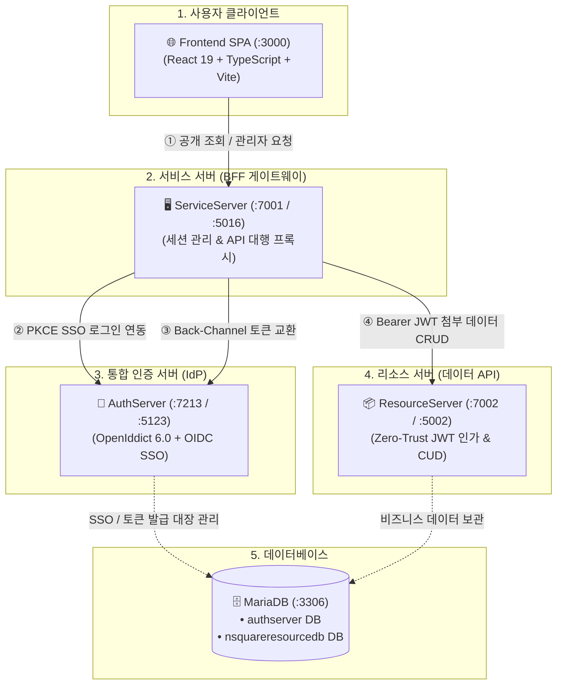

# 🏢 N-SQUARE 통합 플랫폼 (Enterprise Clean Architecture & MSA Ecosystem)

> **Zero-Trust 보안과 OIDC SSO(Single Sign-On), BFF(Backend-For-Frontend) 패턴을 완벽히 구현한 차세대 엔터프라이즈 통합 플랫폼**

엔스퀘어(N-SQUARE) 통합 플랫폼은 **독립된 React 프론트엔드 SPA**와 **3개의 마이크로서비스 백엔드(.NET 10 Clean Architecture)**, 그리고 **MariaDB**로 구성되어 있습니다.

---

## 🏛️ 시스템 아키텍처 및 포트 매핑



### 📌 포트 및 컴포넌트 역할

| 컴포넌트 | HTTPS 포트 | HTTP 포트 | 기술 스택 | 주요 역할 |
| :--- | :---: | :---: | :--- | :--- |
| **🌐 Frontend** | - | **`:3000`** | React 19, TS, Vite | 사용자 화면 UI, View-Only 메인 홈, 관리자 상세 페이지, 자동 SSO 연동 |
| **🖥️ ServiceServer** | **`:7001`** | **`:5016`** | .NET 10, ASP.NET Core | **BFF Gateway**, PKCE verifier 생성, 세션 쿠키(`.NsqHomepage.ServiceSession`) 발급 |
| **📦 ResourceServer** | **`:7002`** | **`:5002`** | .NET 10, EF Core | 데이터 CRUD API (회사 소개, 주요 서비스, 회사 연혁), JWT 서명/만료 독자 검증 |
| **🔐 AuthServer** | **`:7213`** | **`:5123`** | OpenIddict 6, EF Core | OIDC 인가 서버 (IdP), 계정 검증, `AuthServer_SSO_Cookie`(14일) 발급, 토큰 발행 |
| **🗄️ MariaDB** | - | **`:3306`** | MariaDB 12.x | 계정/SSO 토큰(`authserver`), 비즈니스 데이터(`nsquareresourcedb`) 저장 |

---

## 🔐 2-Track 파이프라인 및 보안 아키텍처

```mermaid
graph LR
    A[사용자 요청] --> B{요청 유형}
    B -->|트랙 A: 공개 정보 조회| C[누구나 즉시 조회<br/>(로그인 불필요 200 OK)]
    B -->|트랙 B: 관리자 등록/수정/삭제| D[BFF 서비스 세션 검증]
    D --> E{세션 보유 여부}
    E -->|보유| F[Bearer JWT 첨부 ➔ ResourceServer Zero-Trust 검증 ➔ 200 OK]
    E -->|미보유| G[SSO 파이프라인 가동<br/>(Silent SSO ➔ 세션 쿠키 자동 발급 ➔ 완료)]
```

### 1. 트랙 A: 공개 조회 (Public Read)
- **URL**: `GET /api/public/company-about`, `GET /api/public/company-services`, `GET /api/public/company-histories`
- **보안 정책**: 로그인 없이 익명 방문자 누구나 즉시 고속 조회 가능 (Gateway 대행 호출)

### 2. 트랙 B: 관리자 전용 CUD (Admin Write/Delete)
- **URL**: `PUT /api/admin/company-about`, `PUT /api/admin/company-services`, `PUT /api/admin/company-histories`, `DELETE /api/admin/company-histories/{id}`
- **보안 정책**:
  - `Role == Admin` 검증
  - 브라우저에는 `HttpOnly` 서비스 세션 쿠키만 노출하여 **XSS 공격 시 토큰 탈취를 원천 차단**
  - 서비스 서버가 서버 메모리에 숨겨둔 15분 단수명 `access_token`(JWT)을 첨부하여 리소스 서버 호출

### 3. SSO 쿠키 vs 서비스 세션 쿠키 이중화
| 구분 | 보관 위치 | 수명 | 설명 |
| :--- | :--- | :---: | :--- |
| **`AuthServer_SSO_Cookie`** | `:7213` (AuthServer) | **14일** | 전역 통합 로그인 상태 유지 쿠키. 유효 시 로그인 화면(`/login`) 없이 자동 통과 |
| **`.NsqHomepage.ServiceSession`** | `:7001` (ServiceServer) | **15분** | 각 서비스 작업용 단수명 BFF 세션 쿠키. 만료 시 SSO 쿠키로 무자각 자동 재발급 |

---

## 📑 Swagger UI 단계별 엔드포인트 명세

### [ServiceServer] Swagger UI (`https://localhost:7001/swagger`)
- **`Step 1. SSO 시작 & PKCE/CSRF 키 발급`**: `GET /api/auth/start-sso`
- **`Step 5. CSRF State 일치 검증`**: `GET /api/auth/verify-state`
- **`Step 6. Back-Channel 직통신 토큰 교환`**: `POST /api/auth/backchannel-token-exchange` *(Access/Refresh Token 수신)*
- **`Step 7. 서비스 세션 쿠키 발급 및 OIDC 콜백`**: `GET /api/auth/oidc-callback` *(`.NsqHomepage.ServiceSession` 발급)*
- **`Step 8. 세션 메모리 보관 토큰 확인`**: `GET /api/auth/session-tokens`
- **`Step 9. 세션 쿠키 기반 사용자 신원/권한 확인`**: `GET /api/auth/user-identity`, `GET /api/auth/me`
- **`Step 10. Zero-Trust 관리자 리소스 CRUD`**: `PUT /api/admin/company-about`, `PUT /api/admin/company-services`, `PUT /api/admin/company-histories`, `DELETE /api/admin/company-histories/{id}`
- **`Step 11. 서비스 세션 로그아웃 & 토큰 갱신`**: `POST /api/auth/refresh`, `GET/POST /api/auth/logout`

### [AuthServer] Swagger UI (`https://localhost:7213/swagger`)
- **`Step 2. SSO 인증 & 암호화 쿠키 발급`**: `POST /api/account/login`
- **`Step 3. OIDC 인가 코드 발급 & DB 해시 저장`**: `POST /api/account/authorize-code`
- **`Step 4. MariaDB 저장 내역 및 1회용 코드 상태 확인`**: `GET /api/account/authorization-codes`
- **`Step 6. Back-Channel 토큰 교환 & OIDC 토큰 세트 발급`**: `POST /api/account/token-exchange`
- **`Step 11. SSO 전역 세션 로그아웃`**: `POST /api/account/logout`

---

## 🚀 빠른 시작 가이드 (Getting Started)

### 1. 사전 요구사항
- [.NET 10 SDK](https://dotnet.microsoft.com/download)
- [Node.js 20+ & npm](https://nodejs.org/)
- [MariaDB 11.x / 12.x](https://mariadb.org/) (포트 `3306`, 계정: `root`, 암호: `1234`)

### 2. 프로젝트 빌드 및 로컬 실행

```powershell
# 1. 백엔드 프로젝트 빌드
dotnet build AuthServer/src/Web
dotnet build ResourceServer/src/Web
dotnet build ServiceServer/src/Web

# 2. 프론트엔드 빌드 및 의존성 설치
cd Frontend
npm install
npm run build
cd ..

# 3. 각 서버 실행 (개별 터미널에서 실행)
# [터미널 1] 인증 서버 실행 (:7213)
dotnet run --project AuthServer/src/Web --launch-profile https

# [터미널 2] 리소스 서버 실행 (:7002)
dotnet run --project ResourceServer/src/Web --launch-profile https

# [터미널 3] 서비스 게이트웨이 실행 (:7001)
dotnet run --project ServiceServer/src/Web --launch-profile https

# [터미널 4] 프론트엔드 개발 서버 실행 (:3000)
cd Frontend
npm run dev
```

### 3. 브라우저 접속
- **프론트엔드 메인 홈페이지**: [http://localhost:3000](http://localhost:3000)
- **기본 관리자 계정**: `admin@company.local` / `Test1234!` (또는 `test@company.local` / `Test1234!`)
- **ServiceServer Swagger**: [https://localhost:7001/swagger](https://localhost:7001/swagger)
- **AuthServer Swagger**: [https://localhost:7213/swagger](https://localhost:7213/swagger)

---

## 🗄️ 데이터베이스 스키마 및 테이블 요약

| 데이터베이스 | 테이블명 | 설명 |
| :--- | :--- | :--- |
| **`authserver`** | `users` | 사용자 계정 마스터 (Email Unique, DisplayName, PasswordHash, Role) |
| | `loginlogs` | 로그인 시도 감사 로그 (LoginId, IpAddress, Succeeded, AttemptedAtUtc) |
| | `blockedips` | 차단된 IP 관리 목록 (IpAddress Unique, Reason) |
| | `authorizationcodes` | 1분 수명의 OIDC PKCE 인가 코드 해시 및 스냅샷 (SHA-256 해시 저장) |
| | `refreshtokens` | 14일 수명의 리프레시 토큰 해시 및 Token Rotation 추적 |
| | `openiddictapplications` | 등록된 OIDC 클라이언트 앱 및 콜백 URL 화이트리스트 |
| | `openiddictauthorizations` | 사용자별 클라이언트 권한 위임/동의 이력 |
| | `openiddictscopes` | 정의된 권한 스코프 카탈로그 |
| **`nsquareresourcedb`** | `companyabouts` | 회사 소개 본문 데이터 (`Content`, `UpdatedAt`) |
| | `companyservices` | 회사 제공 서비스 상세 데이터 (`Content`, `UpdatedAt`) |
| | `companyhistories` | 회사 연혁 및 주요 성과 내역 (`EventDate`, `Content`, `CreatedAt`) |

---

## 📂 프로젝트 디렉토리 구조

```text
NSquareHomepage/
├── 🌐 Frontend/                # React 19 + TypeScript + Vite SPA (:3000)
│   ├── src/
│   │   ├── components/         # Header, HeroSection, View-only Sections, Inspector 등
│   │   ├── pages/              # HomePage (View-only), AboutPage, ServicePage, HistoryPage, LoginPage
│   │   ├── api.ts              # 통합 API 클라이언트 (SSO Redirect, BFF Credentials 포함)
│   │   └── types.ts            # DTO 및 인터페이스 타입 정의
│   └── package.json
│
├── 🖥️ ServiceServer/           # BFF API Gateway & 세션 관리자 (:7001)
│   └── src/
│       ├── Domain/             # 엔터티 및 비즈니스 인터페이스
│       ├── Application/        # UseCases (Auth, Admin, Public) & DTOs
│       ├── Infrastructure/     # OIDC State, TokenExchange, ResourceApiClient
│       └── Web/                # Controllers (Auth, About, Services, Histories)
│
├── 📦 ResourceServer/          # 데이터 리소스 API 서버 (:7002)
│   └── src/
│       ├── Domain/             # CompanyAbout, CompanyService, CompanyHistory 엔터티
│       ├── Application/        # CUD UseCases & Repositories
│       ├── Infrastructure/     # MariaDB DbContext & JWT 검증
│       └── Web/                # Controllers (About, Services, Histories)
│
├── 🔐 AuthServer/              # OIDC SSO 인증 서버 (:7213)
│   └── src/
│       ├── Domain/             # User, AuthorizationCode, RefreshToken, LoginLog, BlockedIp 엔터티
│       ├── Application/        # 계정 관리 및 인증 로직
│       ├── Infrastructure/     # MariaDB DbContext, OpenIddict 설정
│       └── Web/                # AuthorizationController, AccountController, Login Razor Page
│
├── docs/                       # 상세 아키텍처 및 SSO 파이프라인 명세서
└── docker-compose.yml          # 전체 컨테이너 오케스트레이션
```

