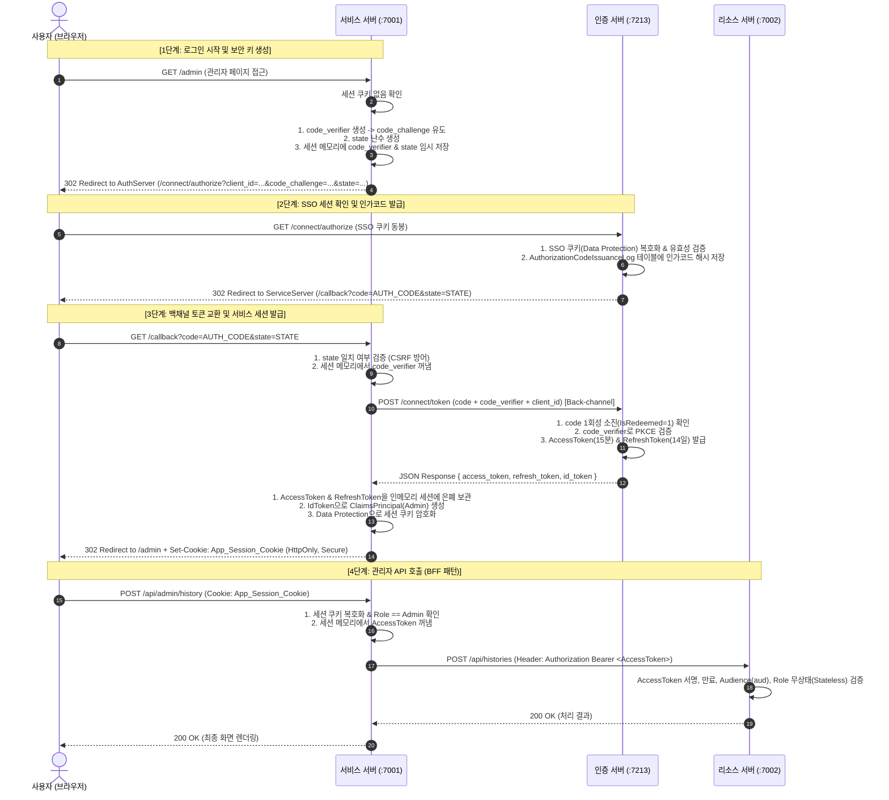

# 🔐 N-SQUARE 통합 인증·세션 및 데이터베이스 전체 명세서
### (Authentication, Token, In-Memory Session & Database Specification)

> **문서 버전**: v2.0  
> **최종 수정일시**: 2026-08-27  
> **관련 프로젝트**: AuthServer (:7213), ServiceServer (:7001), ResourceServer (:7002)  
> **주요 기술 스택**: .NET 10, OpenIddict 6.x, MariaDB 12.3, ASP.NET Core Data Protection, OIDC / OAuth 2.0 (PKCE)

---

## 📑 목차
1. [데이터베이스 전체 테이블 상세 명세 (Database Schemas)](#1-데이터베이스-전체-테이블-상세-명세)
   - 1.1 `authserver` 데이터베이스 (9개 테이블)
   - 1.2 `NSquareResourceDb` 데이터베이스 (3개 테이블)
2. [서비스 서버 세션 메모리 저장 데이터 상세 명세 (In-Memory Session)](#2-서비스-서버-세션-메모리-저장-데이터-상세-명세)
   - 2.1 PKCE 검증 키 (`code_verifier` & `code_challenge`)
   - 2.2 CSRF 검증 키 (`state` & Nonce)
   - 2.3 `AccessToken` (API 접근 토큰)
   - 2.4 `RefreshToken` (토큰 갱신 및 회전)
   - 2.5 `IdToken` (사용자 신원 증명 토큰)
3. [브라우저에 저장되는 서비스 세션 쿠키 상세 명세 (Browser Session Cookie)](#3-브라우저에-저장되는-서비스-세션-쿠키-상세-명세)
   - 3.1 쿠키 기본 속성 및 보안 플래그 (`HttpOnly`, `Secure`, `SameSite`)
   - 3.2 BFF(Backend-For-Frontend) 패턴과 자격증명 은폐 메커니즘
   - 3.3 인증서버 SSO 쿠키 vs 서비스 세션 쿠키 비교
   - 3.4 Data Protection 암호화 및 위변조 방어 메커니즘
4. [전체 인증 및 토큰 교환 파이프라인 시퀀스 다이어그램](#4-전체-인증-및-토큰-교환-파이프라인-시퀀스)

---

## 1. 데이터베이스 전체 테이블 상세 명세

시스템은 계정/인증을 전담하는 **`authserver` DB**와 비즈니스 컨텐츠를 관리하는 **`NSquareResourceDb` DB**로 물리 분리되어 있습니다.

```text
[authserver DB (인증/세션/보안)]
  ├── users                         : 사용자 계정 마스터
  ├── AuthorizationCodeIssuanceLog  : 인가 코드 발급/소진 이력 (1분 수명, SHA-256)
  ├── RefreshTokenLedger            : 리프레시 토큰 원장 (14일 수명, Token Rotation)
  ├── LoginAuditLog                 : 로그인 시도 감사 로그 (IP, 계정, 성공여부)
  ├── IpBlocklist                   : IP 접근 차단 방화벽 정책
  ├── OpenIddictApplications        : OIDC 등록 클라이언트 앱 (영문 HomepageName 제약)
  ├── OpenIddictAuthorizations      : 사용자 권한 위임(Consent) 승인 내역
  ├── OpenIddictScopes              : 스코프 카탈로그 (영문 DisplayName/Description 제약)
  └── OpenIddictTokens              : OpenIddict 내부 토큰 아티팩트 저장소

[NSquareResourceDb DB (비즈니스 리소스)]
  ├── CompanyAbouts                 : 회사 소개 정보
  ├── CompanyServices               : 주요 서비스 내역
  └── CompanyHistories              : 회사 연혁 정보
```

---

### 1.1 `authserver` 데이터베이스 (9개 테이블)

#### 📋 1. `users` (사용자 마스터 테이블)
* **테이블 설명**: 사용자의 기본 계정 정보와 역할을 영속 보관하는 핵심 마스터 테이블.
* **설계 특징**: JWT 토큰의 `sub`, `email`, `name`, `role` 클레임의 원천 데이터이며, 비밀번호는 PBKDF2 단방향 해시로 암호화 보관.

| 칼럼명 | 데이터 타입 | 제약 조건 | 설명 |
| :--- | :--- | :---: | :--- |
| **`Id`** | `BIGINT` | PK, Auto Increment | 사용자의 불변 고유 식별자 (JWT `sub` 클레임 원천) |
| **`Email`** | `VARCHAR(256)` | Unique Index, Not Null | 사용자 로그인 ID (중복 가입 방지 고유 키) |
| **`UserName`** | `VARCHAR(256)` | Not Null | 사용자 표시 이름 (JWT `name` 클레임 원천) |
| **`PasswordHash`** | `LONGTEXT` | Not Null | PBKDF2-SHA256 단방향 솔트 암호화된 비밀번호 해시 |
| **`Role`** | `INT` | Not Null | RBAC 권한 Enum (`0=Customer`, `1=Employee`, `2=Admin`) |

---

#### 📋 2. `AuthorizationCodeIssuanceLog` (인가 코드 발급 로그 및 1회용 소진 원장)
* **테이블 설명**: OIDC `/connect/authorize` 성공 시 클라이언트에게 발급되는 **초단기(1분) 인가 코드**의 SHA-256 해시 및 스냅샷 저장소.
* **설계 특징**: 토큰 교환 시 `users` 테이블 JOIN 없이 $O(1)$로 토큰을 만들기 위해 사용자 정보를 스냅샷 반정규화 보관하며, 1회 교환 즉시 `IsRedeemed = 1`로 소진 처리하여 재사용 공격을 방어.

| 칼럼명 | 데이터 타입 | 제약 조건 | 설명 |
| :--- | :--- | :---: | :--- |
| **`Id`** | `BIGINT` | PK, Auto Increment | 인가 코드 발급 레코드 식별자 |
| **`AuthorizationCodeHash`** | `VARCHAR(128)` | **Unique Index**, Not Null | 인가 코드 평문의 SHA-256 해시 (평문 유출 방지 및 조회 키) |
| **`CodeChallengeHash`** | `VARCHAR(128)` | Not Null | PKCE `code_challenge`의 SHA-256 해시 (토큰 교환 시 대조 검증용) |
| **`ClientId`** | `VARCHAR(128)` | Not Null | 인가를 요청한 클라이언트 ID (`company-homepage`) |
| **`RedirectUri`** | `VARCHAR(512)` | Not Null | 인가 완료 콜백 URL (토큰 교환 요청 시 위변조 대조 검증) |
| **`Subject`** | `VARCHAR(128)` | Not Null | 인증된 사용자 ID (반정규화: JWT `sub` 주입용) |
| **`UserEmail`** | `VARCHAR(256)` | Not Null | 사용자 이메일 (반정규화: JWT `email` 주입용) |
| **`Scope`** | `VARCHAR(512)` | Not Null | 승인된 권한 범위 문자열 (예: `openid profile email offline_access`) |
| **`CreatedAtUtc`** | `DATETIME(6)` | Index, Not Null | 인가 코드 발급 일시 (UTC) |
| **`ExpiresAtUtc`** | `DATETIME(6)` | Index, Not Null | **인가 코드 만료 일시 (발급 후 1분 수명)** |
| **`IsRedeemed`** | `TINYINT(1)` | Not Null (기본값: `0`) | **1회용 소진 여부** (`1`인 경우 재사용 공격으로 간주하여 즉시 거부) |
| **`RedeemedAtUtc`** | `DATETIME(6)` | Nullable | 인가 코드가 토큰으로 교환 완료된 일시 |

---

#### 📋 3. `RefreshTokenLedger` (리프레시 토큰 관리 원장)
* **테이블 설명**: 서비스 서버가 장기 세션을 유지하기 위해 보관하는 **리프레시 토큰(14일 수명)**의 SHA-256 해시 원장.
* **설계 특징**: **Token Rotation(토큰 회전)** 정책을 적용하여 1회 갱신 시 기존 토큰은 폐기(`IsRevoked = 1`)되고 차기 토큰 해시(`ReplacedByTokenHash`)를 기록. 이미 폐기된 토큰으로 재요청 시 탈취로 판단하여 해당 사용자의 전체 세션을 강제 파기.

| 칼럼명 | 데이터 타입 | 제약 조건 | 설명 |
| :--- | :--- | :---: | :--- |
| **`Id`** | `BIGINT` | PK, Auto Increment | 리프레시 토큰 식별자 |
| **`RefreshTokenHash`** | `VARCHAR(128)` | **Unique Index**, Not Null | Refresh Token 평문의 SHA-256 단방향 해시 |
| **`Subject`** | `VARCHAR(128)` | Index, Not Null | 토큰 소유 사용자 ID (`users.Id`) |
| **`UserEmail`** | `VARCHAR(256)` | Not Null | 사용자 이메일 (반정규화: 재발급 시 User 재조회 생략) |
| **`ClientId`** | `VARCHAR(128)` | Not Null | 토큰을 발급받은 클라이언트 ID (`company-homepage`) |
| **`Scope`** | `VARCHAR(512)` | Not Null | 승인된 권한 범위 |
| **`CreatedAtUtc`** | `DATETIME(6)` | Index, Not Null | 토큰 발급 일시 (UTC) |
| **`ExpiresAtUtc`** | `DATETIME(6)` | Index, Not Null | **토큰 만료 일시 (기본 14일 수명)** |
| **`IsRevoked`** | `TINYINT(1)` | Not Null (기본값: `0`) | **폐기 여부** (로그아웃 또는 Token Rotation 시 `1`로 전환) |
| **`RevokedAtUtc`** | `DATETIME(6)` | Nullable | 토큰 폐기 일시 |
| **`ReplacedByTokenHash`**| `VARCHAR(128)`| Nullable | **Token Rotation 추적**: 교체 발급된 차기 토큰의 SHA-256 해시 |

---

#### 📋 4. `LoginAuditLog` (로그인 감사 및 침해사고 조사 로그)
* **테이블 설명**: 로그인 성공 및 실패 이력을 실시간 기록하는 보안 감사 테이블.
* **설계 특징**: 탈퇴한 사용자나 존재하지 않는 임의의 계정(`hacker@test.com`) 공격 시도도 기록할 수 있도록 `UserName`을 문자열로 반정규화.

| 칼럼명 | 데이터 타입 | 제약 조건 | 설명 |
| :--- | :--- | :---: | :--- |
| **`Id`** | `BIGINT` | PK, Auto Increment | 로그인 로그 식별자 |
| **`UserName`** | `VARCHAR(256)` | Composite Index, Not Null | 로그인 시도한 사용자 계정/이메일 문자열 |
| **`IpAddress`** | `VARCHAR(45)` | Composite Index, Not Null | 접속 요청 IP 주소 (IPv4/IPv6 공격 발원지 추적) |
| **`Succeeded`** | `TINYINT(1)` | Not Null | 로그인 성공 여부 (`1=성공`, `0=실패`) |
| **`AttemptedAtUtc`** | `DATETIME(6)` | Composite Index, Not Null | 시도 일시 (IP/계정별 분당 실패율 집계 및 Brute-force 탐지용) |

---

#### 📋 5. `IpBlocklist` (IP 차단 방화벽 정책)
* **테이블 설명**: 악의적인 공격이 탐지된 IP를 즉시 차단하는 인메모리 캐시 연동 방화벽 테이블.
* **설계 특징**: 미들웨어 최상단에서 1분 캐싱을 통해 인메모리 필터링하여 비인가 요청을 $O(1)$로 차단(`403 Forbidden`).

| 칼럼명 | 데이터 타입 | 제약 조건 | 설명 |
| :--- | :--- | :---: | :--- |
| **`Id`** | `INT` | PK, Auto Increment | 차단 레코드 식별자 |
| **`IpAddress`** | `VARCHAR(45)` | **Unique Index**, Not Null | 차단할 클라이언트 IP 주소 |
| **`Reason`** | `LONGTEXT` | Nullable | 관리자 차단 사유 메모 (예: "비정상 로그인 시도 5회 초과") |
| **`BlockedAtUtc`** | `DATETIME(6)` | Not Null | IP 차단 등록 일시 |

---

#### 📋 6. `OpenIddictApplications` (OIDC 신뢰 클라이언트 앱 관리)
* **테이블 설명**: 인증서버를 사용할 수 있도록 등록된 신뢰 클라이언트 애플리케이션 정의 테이블.
* **설계 특징**: `HomepageName` 컬럼에 한글 등록을 차단하는 **영문 전용 제약조건(`CHECK`)** 적용 및 불필요한 다국어 컬럼 제거.

| 칼럼명 | 데이터 타입 | 성격 | 설명 |
| :--- | :--- | :---: | :--- |
| **`Id`** | `VARCHAR(255)` | PK (GUID) | 프레임워크 내부 대리 키 |
| **`ClientId`** | `VARCHAR(100)` | Unique Key, Not Null | 클라이언트 고유 식별자 (`company-homepage`) |
| **`ClientType`** | `VARCHAR(50)` | 필수 | `public` (브라우저 앱은 시크릿 없이 PKCE로 보호) |
| **`ClientSecret`** | `LONGTEXT` | 스키마 | Public 클라이언트는 `NULL` 유지 |
| **`RedirectUris`** | `LONGTEXT` (JSON) | **보안 핵심** | **민감한 인가 코드(`?code=...`)를 전송할 수 있는 허용 콜백 URL 화이트리스트** |
| **`PostLogoutRedirectUris`**| `LONGTEXT` (JSON)| **보안 핵심** | **로그아웃 후 복귀를 허용하는 일반 화면 URL 화이트리스트** |
| **`Permissions`** | `LONGTEXT` (JSON) | 권한 제어 | 허용된 엔드포인트/Grant Type/Scope 화이트리스트 |
| **`Requirements`** | `LONGTEXT` (JSON) | 보안 강제 | `features:pkce` (PKCE 미사용 요청 차단) |
| **`ConsentType`** | `VARCHAR(50)` | 정책 | `implicit` (사내 신뢰 앱이므로 동의 화면 생략) |
| **`HomepageName`**| `LONGTEXT` | **영문 제약 (`CHECK`)** | 클라이언트 영문 명칭 (`Company Homepage` / 한글 차단) |
| **`Properties`** | `LONGTEXT` (JSON) | 확장용 | 추가 커스텀 메타데이터 |
| **`Settings`** | `LONGTEXT` (JSON) | 엔진 설정 | 토큰 수명 등 엔진 설정 오버라이드 |
| **`ConcurrencyToken`** | `VARCHAR(50)` | 동시성 제어 | 갱신 분실(Lost Update) 방지용 낙관적 락 토큰 |

---

#### 📋 7. `OpenIddictAuthorizations` (사용자 권한 위임 이력 원장)
* **테이블 설명**: 사용자가 특정 클라이언트 앱에 권한을 위임(Consent)한 내역을 영속화하여 중복 동의를 생략하고 전역 권한 철회(Revoke)를 추적.

| 칼럼명 | 데이터 타입 | 성격 | 설명 |
| :--- | :--- | :---: | :--- |
| **`Id`** | `VARCHAR(255)` | PK (GUID) | 인가 승인 레코드 식별자 |
| **`Subject`** | `VARCHAR(255)` | Index, Not Null | 권한을 위임한 사용자 ID (`users.Id`) |
| **`ApplicationId`** | `VARCHAR(255)` | FK/Index, Not Null | 권한을 위임받은 클라이언트 앱 ID (`OpenIddictApplications.Id`) |
| **`Scopes`** | `LONGTEXT` (JSON) | 승인 스코프 | 위임 승인된 스코프 목록 (`["openid", "email", "roles"]`) |
| **`Status`** | `VARCHAR(50)` | 상태 | 인가 유효 상태 (`valid`, `revoked`) |
| **`Type`** | `VARCHAR(50)` | 유형 | 인가 지속 유형 (`permanent`, `adhoc`) |
| **`CreationDate`** | `DATETIME(6)` | 승인 일시 | 최초 인가 승인 일시 |
| **`Properties`** | `LONGTEXT` (JSON) | 확장용 | 추가 커스텀 메타데이터 |
| **`ConcurrencyToken`** | `VARCHAR(50)` | 동시성 제어 | 낙관적 락 토큰 |

---

#### 📋 8. `OpenIddictScopes` (인가 스코프 정의 및 카탈로그)
* **테이블 설명**: 시스템에 정의된 권한 범위(Scope)의 명칭, 설명, 대상 리소스 서버(Audience) 메타데이터를 관리하는 원장.
* **설계 특징**: `DisplayName`과 `Description` 컬럼에 **영문 전용 제약조건(`CHECK`)** 적용 및 불필요한 다국어 복수형 컬럼 제거.

| 칼럼명 | 데이터 타입 | 성격 | 설명 |
| :--- | :--- | :---: | :--- |
| **`Id`** | `VARCHAR(255)` | PK (GUID) | 스코프 식별자 |
| **`Name`** | `VARCHAR(200)` | **Unique Key**, Not Null | 스코프 고유 코드명 (`openid`, `profile`, `email` 등) |
| **`DisplayName`** | `LONGTEXT` | **영문 제약 (`CHECK`)** | 동의 화면에 노출할 영문 표시 명칭 (한글 차단) |
| **`Description`** | `LONGTEXT` | **영문 제약 (`CHECK`)** | 영문 상세 안내 설명 문구 (한글 차단) |
| **`Resources`** | `LONGTEXT` (JSON) | 대상 리소스 | 이 스코프가 유효한 리소스 서버 URL 목록 (`aud` 자동 주입) |
| **`Properties`** | `LONGTEXT` (JSON) | 확장용 | 추가 커스텀 메타데이터 |
| **`ConcurrencyToken`** | `VARCHAR(50)` | 동시성 제어 | 낙관적 락 토큰 |

---

#### 📋 9. `OpenIddictTokens` (OIDC 프레임워크 내부 토큰 아티팩트 저장소)
* **테이블 설명**: OpenIddict 엔진이 OIDC 표준 프로토콜 검증(코드 1회성 소진, 토큰 암호화 페이로드 보관, 일괄 폐기)을 처리하기 위한 프레임워크 전용 저장소.

| 칼럼명 | 데이터 타입 | 성격 | 설명 |
| :--- | :--- | :---: | :--- |
| **`Id`** | `VARCHAR(255)` | PK (GUID) | 토큰 레코드 식별자 |
| **`Type`** | `VARCHAR(50)` | 토큰 종류 | `authorization_code`, `refresh_token`, `access_token` |
| **`Subject`** | `VARCHAR(400)` | 사용자 식별자 | 토큰 소유 사용자 ID (`users.Id`) |
| **`ApplicationId`** | `VARCHAR(255)` | 클라이언트 | 대상 클라이언트 앱 ID (`OpenIddictApplications.Id`) |
| **`AuthorizationId`** | `VARCHAR(255)` | 부모 인가 | 연결된 인가 승인 ID (`OpenIddictAuthorizations.Id`) |
| **`Payload`** | `LONGTEXT` | 암호화 본문 | 암호화된 토큰 클레임 및 메타데이터 |
| **`Status`** | `VARCHAR(50)` | 상태 | 토큰 상태 (`valid`, `redeemed`, `revoked`) |
| **`CreationDate`** | `DATETIME(6)` | 발급 일시 | 토큰 생성 시각 |
| **`ExpirationDate`** | `DATETIME(6)` | 만료 일시 | 토큰 유효기간 만료 시각 |
| **`RedemptionDate`** | `DATETIME(6)` | 소진 일시 | 인가 코드가 토큰으로 교환 완료된 시각 |
| **`ReferenceId`** | `VARCHAR(100)` | 검색 키 | 토큰 검색용 식별 해시 |
| **`Properties`** | `LONGTEXT` (JSON) | 확장용 | 추가 커스텀 메타데이터 |
| **`ConcurrencyToken`** | `VARCHAR(50)` | 동시성 제어 | 낙관적 락 토큰 |

---

### 1.2 `NSquareResourceDb` 데이터베이스 (3개 테이블)

인증 서버와 물리적으로 완전히 분리된 비즈니스 전용 데이터베이스입니다.

#### 📋 1. `CompanyAbouts` (회사 소개)
* **`Id`** (`INT` PK Auto Inc) : 소개 레코드 고유 번호
* **`Introduction`** (`VARCHAR(4000)`) : 회사 소개 상세 본문
* **`UpdatedAt`** (`DATETIME(6)`) : 최종 수정 일시

#### 📋 2. `CompanyServices` (주요 서비스)
* **`Id`** (`INT` PK Auto Inc) : 서비스 레코드 고유 번호
* **`Service`** (`VARCHAR(4000)`) : 제공 서비스 상세 설명
* **`UpdatedAt`** (`DATETIME(6)`) : 최종 수정 일시

#### 📋 3. `CompanyHistories` (회사 연혁)
* **`Id`** (`INT` PK Auto Inc) : 연혁 레코드 고유 번호
* **`Date`** (`DATE`) : 연혁 발생 일자 (YYYY-MM-DD)
* **`Content`** (`VARCHAR(1000)`) : 주요 성과 및 연혁 내용
* **`CreatedAt`** (`DATETIME(6)`) : 등록 일시

---

## 2. 서비스 서버 세션 메모리 저장 데이터 상세 명세

서비스 서버(BFF, `:7001`)는 클라이언트 브라우저에 토큰을 절대 노출하지 않고, **백엔드 인메모리 세션(In-Memory Session Cache)**에 보안 키와 토큰을 은폐 보관합니다.

```
[서비스 서버 인메모리 세션 (BFF Session Store)]
 ├── [인증 진행 단계 (임시 5분)]
 │     ├── PKCE 검증 키 (`code_verifier`)   : 인가 코드 탈취 방어용 원본 난수
 │     └── CSRF 검증 키 (`state`)           : 로그인 요청-응답 위변조 방어용 Nonce
 └── [인증 완료 단계 (로그인 세션 14일)]
       ├── AccessToken (JWT, 15분 수명)     : 리소스 서버 API 호출용 베어러 토큰
       ├── RefreshToken (14일 수명)         : 만료된 AccessToken 자동 갱신용
       └── IdToken (JWT) & ClaimsPrincipal  : 사용자 프로필 (ID, Email, Name, Role)
```

---

### 2.1 PKCE 검증 키 (`code_verifier` & `code_challenge`)

* **개념**: OAuth 2.0 PKCE(RFC 7636, Proof Key for Code Exchange) 표준에 따라 인가 코드 가로채기 공격(Authorization Code Interception Attack)을 방어하기 위한 암호학적 검증 키 세트.
* **생성 및 보관 메커니즘**:
  1. **`code_verifier` 생성**: 서비스 서버가 암호학적 난수 생성기를 통해 43~128자의 고엔트로피 무작위 문자열 생성.
  2. **`code_challenge` 유도**: `code_challenge = BASE64URL(SHA256(code_verifier))` 계산.
  3. **임시 세션 저장**: 서비스 서버는 `code_verifier` 원본을 자신의 **세션 메모리에 은폐 보관**.
  4. **인증서버 전송**: 브라우저를 `/connect/authorize`로 보낼 때 계산된 `code_challenge`만 쿼리 스트링에 첨부.
* **검증 단계**:
  * 토큰 교환 단계(`/connect/token`)에서 서비스 서버가 백엔드 채널로 `code_verifier` 원본을 전송.
  * 인증서버는 자신이 보관하던 `code_challenge`와 `SHA256(code_verifier)`가 일치하는지 $O(1)$로 대조.
* **보안 목적**: 공격자가 중간에서 인가 코드(`code`)를 가로채더라도, 서비스 서버의 메모리에만 있는 `code_verifier`를 알 수 없으므로 토큰으로 교환할 수 없습니다.

---

### 2.2 CSRF 검증 키 (`state` & Correlation State)

* **개념**: 클라이언트가 시작한 로그인 요청과 인증서버로부터 돌아온 콜백 응답이 동일한 브라우저 세션에서 발생했음을 보장하는 고유 Nonce.
* **동작 원리**:
  1. 서비스 서버는 로그인 리다이렉트 직전 암호학적 난수 `state` 문자열(GUID)을 생성하여 **세션 메모리(또는 암호화된 임시 Correlation Cookie)에 저장**.
  2. 인증서버로 요청 시 `?state=<value>`를 전달.
  3. 인증서버는 인가 완료 콜백 시 클라이언트에게 동일한 `state` 값을 그대로 반환.
  4. 서비스 서버는 콜백 수신 시 세션 메모리에 저장해 둔 원본 `state`와 응답으로 돌아온 `state`가 일치하는지 검증.
* **보안 목적**: 제3자가 생성한 악의적인 인가 코드를 피해자의 브라우저에 강제로 주입하여 공격자 계정으로 로그인시키는 **로그인 CSRF(Login CSRF)** 공격을 100% 방어합니다.

---

### 2.3 `AccessToken` (API 접근 인가 토큰)

* **형식 및 발급 주체**: 인증서버가 X.509 비대칭키(RS256)로 서명하여 발급한 **JWT (JSON Web Token)**.
* **수명**: **15분 (초단기)**.
* **보관 위치**: **서비스 서버 백엔드 세션 메모리** (브라우저 JavaScript 및 LocalStorage 접근 전면 차단).
* **페이로드 구조 (Payload Claims)**:
  ```json
  {
    "iss": "https://localhost:7213/",
    "sub": "1",
    "aud": "https://localhost:7002/",
    "exp": 1756285200,
    "nbf": 1756284300,
    "iat": 1756284300,
    "scope": "openid profile email offline_access",
    "name": "홍길동",
    "email": "test@company.local",
    "role": "Admin"
  }
  ```
* **활용 방식**:
  * 사용자가 관리자 화면에서 데이터 변경(CUD)을 요청하면, 서비스 서버는 세션 메모리에서 `AccessToken`을 꺼내어 리소스 서버(`:7002`) 호출 시 HTTP 헤더에 실어 보냅니다:
    ```http
    Authorization: Bearer <AccessToken>
    ```
* **검증 방식**: 리소스 서버는 인증서버에 매번 묻지 않고, 인증서버의 공개키(JWKS)로 **서명, 유효기간, Audience(`aud`), 역할(`role=Admin`)을 자체 메모리에서 무상태(Stateless)로 초고속 검증**합니다.

---

### 2.4 `RefreshToken` (토큰 갱신 및 장기 세션 유지)

* **형식 및 발급 주체**: 인증서버가 발급한 불투명(Opaque) 또는 고유 해시 기반 토큰.
* **수명**: **14일 (장기 수명)**.
* **보관 위치**: **서비스 서버 백엔드 세션 메모리** (외부 노출 제로).
* **동작 원리 (Token Rotation)**:
  1. 15분이 지나 `AccessToken`이 만료되면, 서비스 서버는 백엔드 백채널로 인증서버의 `/connect/token` (`grant_type=refresh_token`)을 호출.
  2. 인증서버는 `RefreshTokenLedger` 테이블에서 해시를 대조하고, 기존 토큰을 즉시 폐기(`IsRevoked = 1`).
  3. 새로운 `AccessToken`(15분)과 **새로운 `RefreshToken`(14일)** 세트를 서비스 서버에 재발급.
  4. 서비스 서버는 세션 메모리의 토큰을 최신 토큰으로 교체.
* **보안 목적**: 사용자에게 잦은 재로그인을 요구하지 않으면서도, 단기 AccessToken과 Token Rotation을 통해 토큰 탈취 위협을 최소화합니다.

---

### 2.5 `IdToken` (사용자 신원 증명 토큰)

* **형식 및 발급 주체**: OIDC 표준 신원 증명용 JWT.
* **보관 위치**: 서비스 서버 메모리 (최초 로그인 시 사용자 프로필 파싱 후 세션 객체로 변환).
* **주요 클레임**: `sub`(사용자 ID), `email`, `name`, `auth_time`(인증 시각), `nonce`, `at_hash`.
* **역할**:
  * 서비스 서버는 `IdToken`의 서명과 클레임을 검증하여 *"이 사용자가 방금 정상적으로 로그인을 마친 사용자 누구인가"*를 확인합니다.
  * 검증 완료 후 `ClaimsPrincipal` 객체를 구성하여 서비스 세션에 저장함으로써, 프론트엔드 템플릿 화면에 사용자 이름("홍길동님 환영합니다")과 역할을 즉시 렌더링할 수 있게 합니다.

---

## 3. 브라우저에 저장되는 서비스 세션 쿠키 상세 명세

브라우저가 실제로 보관하는 쿠키는 **단 1개의 암호화된 서비스 세션 쿠키**입니다.

---

### 3.1 쿠키 기본 속성 및 보안 플래그

| 속성 항목 | 설정 값 | 보안 및 기술적 의미 |
| :--- | :--- | :--- |
| **쿠키 명칭** | `App_Session_Cookie` | 서비스 서버 애플리케이션 세션 식별 쿠키 |
| **발급 주체** | 서비스 서버 (`:7001`) | 로그인 완료 시 서비스 서버가 `Set-Cookie` 응답 헤더로 발급 |
| **기본 수명** | **14일** | `ExpireTimeSpan = TimeSpan.FromDays(14)` |
| **갱신 정책** | **Sliding Expiration** | 수명(14일)의 절반 경과 후 요청 시 만료일이 자동으로 14일 연장 |
| **`HttpOnly`** | **`true` (필수)** | **자바스크립트(`document.cookie`)의 접근 전면 차단 (XSS 토큰 탈취 원천 방어)** |
| **`Secure`** | **`true` (필수)** | 암호화된 HTTPS 통신 채널에서만 전송 (네트워크 패킷 스니핑 방어) |
| **`SameSite`** | **`Lax` (또는 `None`)** | 제3자 사이트에서의 위조 요청을 방어 (CSRF 공격 방어) |

---

### 3.2 BFF(Backend-For-Frontend) 패턴과 자격증명 은폐 메커니즘

본 시스템은 보안 모범 사례인 **BFF 아키텍처**를 엄격히 준수합니다.

```
[ 브라우저 (사용자 PC) ]
   │
   │  🔒 오직 `App_Session_Cookie`만 전송 (토큰 노출 ZERO)
   ▼
[ 서비스 서버 (BFF Gateway) ] ── (인메모리 세션에서 AccessToken 추출) ──┐
   │                                                                    │
   │  🌐 Back-channel 통신 (Bearer Token 첨부)                           │
   ▼                                                                    ▼
[ 인증 서버 (:7213) ]                                         [ 리소스 서버 (:7002) ]
(SSO 검증 및 토큰 발급)                                        (비즈니스 데이터 API 처리)
```

1. **클라이언트 영역 (브라우저 ↔ 서비스 서버)**:
   * 브라우저는 어떠한 AccessToken, RefreshToken, API Key도 가지지 않습니다.
   * 오직 `HttpOnly` 서비스 세션 쿠키만 주고받으므로, 악성 스크립트(XSS)가 침투하더라도 탈취할 수 있는 토큰 자체가 브라우저에 존재하지 않습니다.
2. **서버 간 통신 영역 (서비스 서버 ↔ 리소스 서버)**:
   * 서비스 서버가 브라우저의 세션 쿠키를 검증한 후, 자신의 안전한 메모리에서 `AccessToken`을 꺼내 리소스 서버 API를 호출합니다.

---

### 3.3 인증서버 SSO 쿠키 vs 서비스 세션 쿠키 비교

시스템에는 2가지 종류의 독립된 쿠키가 존재하며, 역할과 도메인이 엄격히 구분됩니다.

| 비교 항목 | 🔐 인증서버 SSO 쿠키 (`AuthServer_SSO_Cookie`) | 🖥️ 서비스 세션 쿠키 (`App_Session_Cookie`) |
| :--- | :--- | :--- |
| **발급 서버** | **인증 서버 (`AuthServer`, :7213)** | **서비스 서버 (`ServiceServer`, :7001)** |
| **보관 목적** | **통합 로그인(SSO) 세션 유지**<br>(타 서비스 이동 시 재로그인 생략) | **서비스 웹사이트 자체 로그인 상태 유지** 및 인메모리 토큰 매핑 |
| **수명** | 14일 (Sliding Expiration) | 14일 (Sliding Expiration) |
| **저장 내용** | 암호화된 인증서버 사용자 인증 티켓 | 암호화된 서비스 세션 티켓 (ClaimsPrincipal) |
| **사용 시점** | `/connect/authorize` 진입 시 인증 확인 | 홈페이지 일반 페이지 탐색 및 관리자 API 요청 시 |

---

### 3.4 Data Protection 암호화 및 위변조 방어 메커니즘

서비스 세션 쿠키는 **ASP.NET Core Data Protection** 암호화 스택으로 보호됩니다.

1. **HMAC-SHA256 전자서명 (위조 방지)**:
   * 서비스 서버의 비밀 키링(KeyRing)으로 서명되어 있으므로, 공격자가 쿠키 내부의 `userId`나 `Role`을 1비트라도 조작하면 서명 검증 실패로 즉시 폐기됩니다.
2. **AES-256 대칭키 암호화 (기밀성)**:
   * 쿠키 내용물은 완벽히 암호화되어 있어 브라우저나 제3자가 내부 데이터를 열람할 수 없습니다.
3. **목적 격리 (Purpose String Isolation)**:
   * 쿠키 암호화 시 `Microsoft.AspNetCore.Authentication.Cookies...`라는 목적 문자열이 키 유도에 포함되어, 다른 용도의 토큰이나 타 서버의 쿠키를 가져와 대입해도 복호화되지 않습니다.
4. **타임스탬프 봉인**:
   * 암호문 내부에 UTC 만료 시각이 봉인되어 있어 클라이언트가 시간을 조작해도 서버 복호화 시 만료 여부가 즉시 적발됩니다.

---

## 4. 전체 인증 및 토큰 교환 파이프라인 시퀀스



---

## 5. 결론 및 보안 요약

1. **데이터베이스 100% 정합성**: 모든 테이블명과 컬럼명이 MariaDB 및 EF Core 소스코드와 완벽하게 일치하며, 영문 제약조건(`CHECK`)을 통해 데이터 무결성을 보장합니다.
2. **완벽한 토큰 은폐 (Zero Token Exposure)**: 브라우저는 단 1개의 암호화된 `HttpOnly` 서비스 세션 쿠키만을 취급하며, 모든 실제 토큰(`Access/Refresh Token`)과 보안 검증 키(`PKCE/state`)는 서비스 서버의 안전한 인메모리 세션에 격리됩니다.
3. **다층 방어 체계**:
   - **XSS 공격**: 브라우저 내 토큰 부재 및 `HttpOnly` 세션 쿠키로 원천 차단
   - **CSRF 공격**: `state` Nonce 검증 및 `SameSite` 쿠키 정책으로 방어
   - **코드/토큰 탈취**: PKCE 원사이드 검증 및 Token Rotation 폐기 체계로 방어
