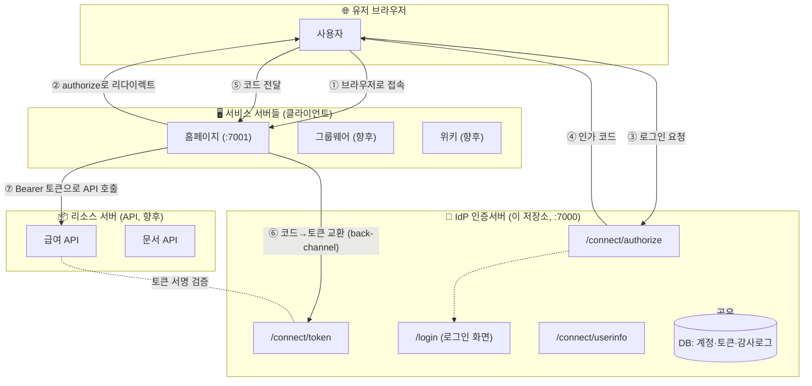
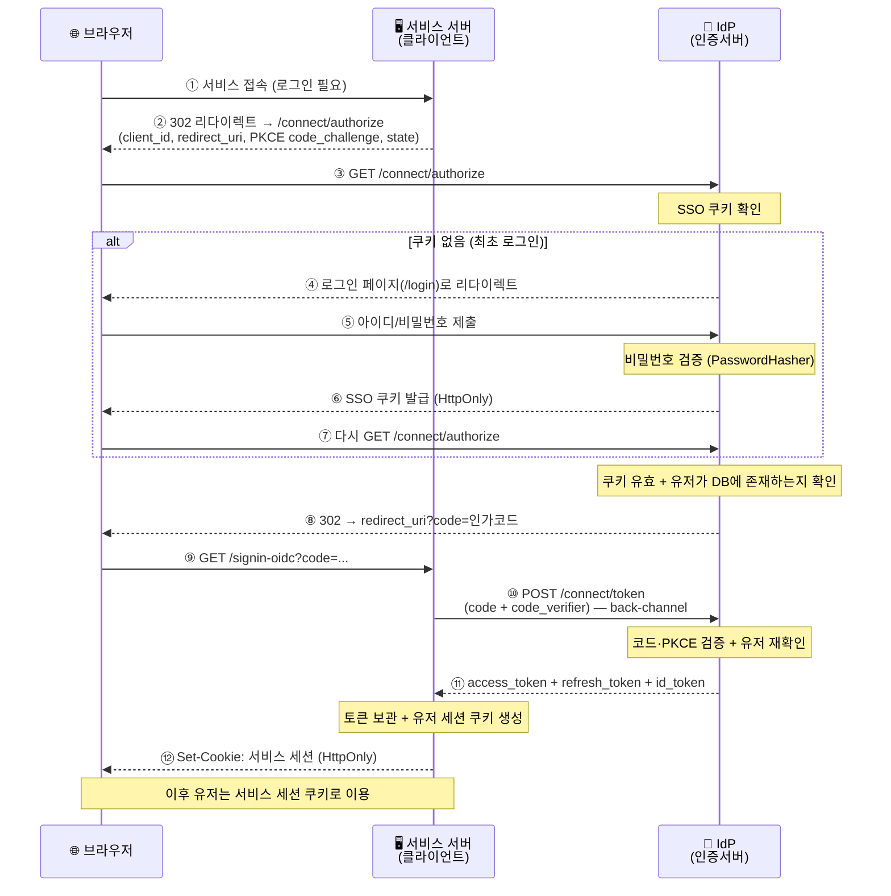
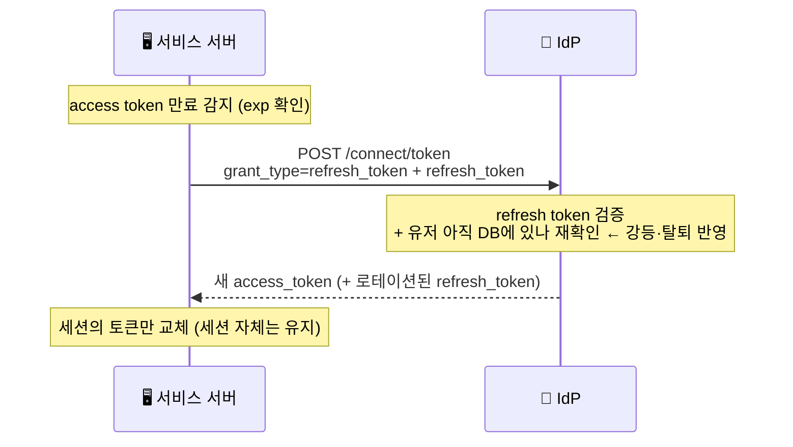
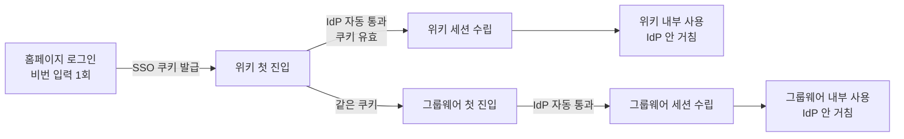
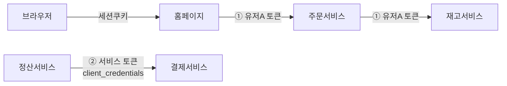

# OIDC / SSO 도입 보고서

> **목적**: 사내 여러 서비스가 **한 번의 로그인을 공유(SSO)** 하도록 OpenID Connect(OIDC)를
> 도입한다. 본 문서는 이 기술의 **원리·목적·동작 과정**을 정리한 도입 보고서 겸 자료조사다.
>
> **대상 독자**: 인증 구조를 처음 접하는 개발자 / 도입 의사결정자
> **기준 구현**: 이 저장소(`AuthServer`, .NET 10 + OpenIddict 6)

---

## 목차

1. [왜 도입하는가 (배경·목적)](#1-왜-도입하는가-배경목적)
2. [핵심 개념과 용어](#2-핵심-개념과-용어)
3. [전체 아키텍처](#3-전체-아키텍처)
4. [동작 과정 — 로그인 플로우](#4-동작-과정--로그인-플로우)
5. [검증 메커니즘 — 무엇을 어떻게 확인하나](#5-검증-메커니즘--무엇을-어떻게-확인하나)
6. [토큰 갱신과 SSO 동작](#6-토큰-갱신과-sso-동작)
7. [세션(쿠키) vs 토큰 — 역할 분담](#7-세션쿠키-vs-토큰--역할-분담)
8. [리소스 서버와 MSA 내부 호출](#8-리소스-서버와-msa-내부-호출)
9. [보안 설계](#9-보안-설계)
10. [현재 구현 현황 (이 저장소)](#10-현재-구현-현황-이-저장소)
11. [확장 로드맵](#11-확장-로드맵)
12. [부록 — FAQ / 흔한 오해](#12-부록--faq--흔한-오해)

---

## 1. 왜 도입하는가 (배경·목적)

### 문제

서비스가 늘어나면(홈페이지 → 그룹웨어 → 위키 …) 각 서비스가 **제각기 로그인**을 구현하게 된다.

- 유저는 서비스마다 따로 로그인해야 함
- 비밀번호·계정 관리가 서비스마다 흩어짐
- 강제 로그아웃, 계정 정지 같은 통제가 서비스별로 파편화

### 해결: 중앙 인증 서버(IdP) + SSO

**인증(로그인)을 한 곳(IdP)에 모으고**, 각 서비스는 그 결과만 신뢰한다.

- 유저는 **한 번만** 로그인 → 모든 사내 서비스 자동 이용 (**SSO**)
- 계정·비밀번호는 IdP 한 곳에서만 관리
- 로그아웃·정지·권한 변경을 중앙에서 통제

### 왜 하필 OIDC인가

OIDC는 OAuth 2.0 위에 "**로그인(인증)**"을 표준화한 프로토콜이다. 직접 만든 로그인과 달리:

- **검증된 표준** — PKCE, 토큰 서명 등 보안 관행이 프로토콜에 내장
- **확장성** — 서비스가 늘어도 클라이언트 등록만 추가하면 됨
- **생태계** — 라이브러리(OpenIddict 등)가 프로토콜 처리를 대신 해줌

> ⚠️ **단, 서비스가 하나뿐이면 OIDC는 과설계다.** 앱이 1개면 그냥 쿠키 인증으로 충분하다.
> OIDC/IdP는 **"서비스가 2개 이상 될 때"** 값을 한다. 본 프로젝트는 서비스 확장 계획이 있어 도입했다.

---

## 2. 핵심 개념과 용어

| 용어 | 역할 | 한 줄 설명 |
|---|---|---|
| **IdP** (Identity Provider, 인증 서버) | 신원의 **발급자** | 비밀번호를 검증하고 토큰을 발급하는 "권한의 근원". 본 저장소가 이것 |
| **클라이언트** (Client / RP, 서비스 서버) | 신원의 **소비자** | 유저를 상대로 로그인 화면을 위임하고, 토큰을 받아 세션을 관리하는 각 서비스 |
| **리소스 서버** (Resource Server) | 자원의 **제공자** | 토큰이 있어야 쓸 수 있는 API(데이터·기능)를 제공하는 서버 |
| **Access Token** | 자원 접근 열쇠 | 짧은 수명(15분). API 호출 시 `Authorization: Bearer`로 첨부 |
| **Refresh Token** | 재발급 열쇠 | 긴 수명(14일). access token 만료 시 새것을 받는 데 사용 |
| **ID Token** | 신원 증명 | 유저가 누구인지(이름·이메일 등) 담은 JWT |
| **SSO 쿠키** | IdP 세션 | 브라우저↔IdP 간 세션. `/authorize` 재로그인을 생략시키는 SSO의 핵심 |
| **인가 코드** (Authorization Code) | 토큰 교환 티켓 | 1회용·단수명. 이걸 토큰과 교환한다 |

### 세 서버의 역할은 "고정"이 아니라 "그 순간의 역할"

같은 서버가 방향에 따라 여러 모자를 쓴다.

- 유저를 마주하고 로그인·세션을 다루면 → **클라이언트(서비스 서버)**
- 다른 서버가 보낸 토큰을 검증하고 데이터를 주면 → **리소스 서버**

예: `그룹웨어`는 유저가 직접 접속하면 클라이언트, `홈페이지`가 그 API를 호출하면 리소스 서버다.

---

## 3. 전체 아키텍처

**핵심 구성 3층**

1. **IdP (본 저장소)** — 로그인·토큰 발급을 전담하는 **1개**의 중앙 서버
2. **클라이언트(서비스 서버)** — 유저를 상대하는 각 서비스. **서비스당 1개**
3. **리소스 서버(API)** — 토큰으로 보호되는 자원 제공자. 서비스가 쪼개지면 등장

---

## 4. 동작 과정 — 로그인 플로우

**Authorization Code Flow + PKCE**. OIDC의 표준 로그인 흐름이다.

### 4.1 전체 시퀀스 다이어그램

### 4.2 단계별 상세

| 단계 | 주체 | 내용 |
|---|---|---|
| ① | 브라우저 | 유저가 서비스(홈페이지)에 접속 |
| ② | 서비스 서버 | 로그인 안 됨 → IdP `/authorize`로 **302 리다이렉트** (client_id, redirect_uri, PKCE `code_challenge`, state 실어서) |
| ③ | 브라우저 | IdP `/connect/authorize`로 접근 |
| ④~⑦ | IdP | **[쿠키 없음]** 로그인 화면 → 검증 → **SSO 쿠키 발급** → 다시 authorize로 복귀 |
| ⑧ | IdP | **[쿠키 있음]** 쿠키 유효 + 유저 DB 존재 확인 → **인가 코드**를 만들어 redirect_uri로 리다이렉트 |
| ⑨ | 브라우저 | 서비스 서버의 콜백 `/signin-oidc?code=...`로 이동 |
| ⑩ | 서비스 서버 | IdP `/connect/token`에 **code + code_verifier**를 보냄 (**back-channel, 서버↔서버**) |
| ⑪ | IdP | 코드·PKCE 검증 → access/refresh/id 토큰 응답 |
| ⑫ | 서비스 서버 | 토큰을 **자기 쪽에 보관**하고, 유저에겐 **서비스 세션 쿠키**만 발급 |

### 4.3 왜 코드는 브라우저로, 토큰 교환은 뒤에서 하나

- **인가 코드**는 URL에 노출됨(브라우저 히스토리·로그로 샐 수 있음) → 그래서 **1회용 + 단수명 + PKCE**로 보호. 코드만 훔쳐선 토큰을 못 받음
- **실제 토큰**은 **back-channel(서버↔서버)** 응답으로 받아 URL에 남기지 않음
- 결과적으로 **브라우저는 토큰을 절대 못 본다** (서버형 클라이언트 기준)

---

## 5. 검증 메커니즘 — 무엇을 어떻게 확인하나

인증 흐름에는 **4가지 자격증명**이 등장하고, 각각 검증 방식이 다르다.

| 대상 | 누가 검증 | 어떻게 | IdP에 매번 HTTP? | DB 조회 |
|---|---|---|---|---|
| **SSO 쿠키** | IdP | Data Protection 복호화 + 서명(HMAC) + 만료 | ❌ | 기본 X (본 저장소는 앱 로직으로 유저 재조회) |
| **인가 코드** | IdP | 복호화 + 서명 + **1회용 DB 엔트리** + **PKCE** | — (IdP 내부) | ✅ |
| **Access Token** | **리소스 서버** | **서명 검증**(IdP 공개키) + exp + scope | ❌ (introspection 쓸 때만 O) | 선택 |
| **Refresh Token** | **IdP만** | 서명 + DB 엔트리 + 만료 + 유저 재확인 | ✅ (서비스서버가 IdP 호출) | ✅ |

### 5.1 세션 쿠키 검증

쿠키 안엔 클레임+만료가 담긴 티켓이 **암호화+서명(HMAC)** 되어 있다.

1. **복호화 + 서명 검증** (Data Protection 키) → 위조·변조 쿠키 탈락
2. **만료 확인** (sliding expiration으로 활동 시 갱신)
3. 통과 시 클레임(유저 ID 등) 추출

→ 기본은 **stateless**(DB 조회 없음). 쿠키 자체가 자기완결.

### 5.2 인가 코드 검증 (토큰 교환 시)

1. 코드 **복호화 + 서명 검증**
2. **DB 엔트리 확인** — 존재 + **이미 사용했는가(1회용)** + 만료
3. `redirect_uri`·`client_id` 일치
4. **PKCE 검증** — `SHA256(code_verifier) == code에 박힌 code_challenge`
5. 코드 안의 principal 복원 → **유저가 아직 DB에 있는지 재확인**

> PKCE 덕분에 코드를 탈취해도 `code_verifier`(클라이언트만 보유)가 없으면 4번에서 막힌다.

### 5.3 Access Token 검증 — "가진 쪽"과 "받는 쪽"이 다르다

- **가진 쪽(서비스 서버)**: 자기가 IdP한테 직접 받아 보관한 토큰이라 **신뢰함** → **만료(exp)만** 확인, 만료면 refresh. 서명은 검증 안 함
- **받는 쪽(리소스 서버)**: 남이 들고 온 토큰이라 **의심함** → **IdP 공개키로 서명 검증** + exp + scope + audience

즉 access token의 "진짜 유효성 검증"은 그 토큰을 **받는 API(리소스 서버)의 몫**이다. 그리고 서명은 IdP 공개키만 있으면 **IdP에 물어보지 않고 로컬로** 확인 가능하다(JWT의 자기완결성). 이게 매 요청 IdP를 때리지 않는 이유다.

---

## 6. 토큰 갱신과 SSO 동작

### 6.1 Access Token 재발급 (Refresh)

access token은 짧아서(15분) 자주 만료된다. 서비스 서버가 **뒤에서 조용히** 갱신한다.

**중요**: 세션은 access token과 1:1이 아니라 **유저의 로그인과 1:1**이다.
세션은 유지되고, 그 안의 access token만 15분마다 갈린다.
갱신 시점의 **DB 재확인**으로 강등·탈퇴가 반영된다 → stateless의 "즉시 무효화 불가"를 보완.

### 6.2 SSO — 한 번 로그인으로 여러 서비스

**IdP를 거치는 단위는 "매 요청"이 아니라 "새 서비스 첫 진입"이다.**

| 상황 | IdP 거침? | 유저가 느낌 |
|---|---|---|
| 최초 로그인 | ✅ (로그인 화면) | 로그인함 |
| **다른 서비스 첫 진입** | ✅ (SSO 쿠키로 **자동 통과**) | ❌ 안 보임 |
| 한 서비스 안에서 매 요청 | ❌ (그 서비스 세션) | ❌ |
| 토큰 만료 갱신 | ⚠️ `/token`만 (백그라운드) | ❌ |

로그아웃도 한 번에 — IdP의 SSO 쿠키를 지우면(`/connect/logout`) 전 서비스 SSO가 해제된다.

---

## 7. 세션(쿠키) vs 토큰 — 역할 분담

**"토큰이 더 좋아서"가 아니라, 부르는 주체가 브라우저냐 서버냐에 따라 안전한 도구가 다르다.**

| 구간 | 도구 | 이유 |
|---|---|---|
| 브라우저 ↔ 서비스 서버 | **쿠키(세션)** | HttpOnly로 XSS 방어, 즉시 폐기 가능, 자동 전송, 브라우저는 못 믿음 |
| 서버 ↔ 서버 (API) | **토큰(Bearer)** | 브라우저 없음, stateless, scope 위임, 자기완결 |

### 왜 브라우저에 토큰을 안 주나

1. **XSS 탈취** — 브라우저에 JWT를 두면 XSS로 통째로 털리고, Bearer 토큰은 어디서든 재사용됨.
   반면 **HttpOnly 쿠키는 JS가 읽지 못해** 탈취 불가
2. **즉시 무효화** — 세션은 서버가 쥔 상태라 로그아웃·정지 시 즉시 끊을 수 있음. JWT는 만료 전 폐기가 어려움
3. **자동 전송 + 단순함** — 쿠키는 브라우저가 알아서 붙임

→ **BFF 패턴**: 힘센 토큰(access/refresh)은 **서버에 숨기고**, 브라우저엔 **불투명한 세션 쿠키**만 준다.

### 왜 서버끼리는 쿠키를 안 쓰나

- 쿠키는 **도메인에 묶임** → A 쿠키를 B 도메인에 못 보냄
- 서버 대 서버엔 쿠키를 들고 있을 브라우저가 없음
- 세션은 공유 저장소가 필요하지만 토큰은 공개키만 있으면 됨

---

## 8. 리소스 서버와 MSA 내부 호출

### 8.1 리소스 서버란

**토큰이 있어야 쓸 수 있는 API(데이터·기능)를 제공하는 서버.** DB 자체가 아니라 DB 앞에서 검문하는 **API 창구**다.

- "리소스"는 데이터만이 아니라 **기능(액션)** 도 포함 (예: "메일 보내기 API")
- **내부/외부 구분과 무관** — 사내 서버가 불러도 토큰을 검증한다(**zero-trust**). "홈페이지 서버니까 믿는다"가 아니라, **토큰 안의 유저·scope**로 권한을 판단해야 하기 때문

### 8.2 MSA 내부 호출에서의 토큰 — 두 종류

서비스가 쪼개지면(MSA) 서버끼리 토큰을 주고받는다. 토큰은 두 결로 나뉜다.

| | ① 유저 토큰 | ② 서비스 토큰 |
|---|---|---|
| 나타내는 것 | 최종 유저 (sub + scope) | 서비스 자신 (client_id) |
| 언제 | 유저 요청이 서비스들을 타고 흐를 때 | 유저 없는 서버 자율 호출(배치 등) |
| Grant | authorization_code / refresh | **client_credentials** |

각 서비스는 **내부 호출이어도 토큰을 검증**하고, 토큰의 유저·scope로 권한을 판단한다.

---

## 9. 보안 설계

| 항목 | 적용 | 효과 |
|---|---|---|
| **PKCE 강제** | 모든 인가 코드 흐름 | 코드 탈취해도 `code_verifier` 없으면 무용지물 |
| **HttpOnly 쿠키** | SSO 쿠키·서비스 세션 | XSS가 쿠키를 읽지 못함 |
| **토큰 back-channel 교환** | 토큰은 서버↔서버로만 | 브라우저·URL에 토큰 노출 없음 |
| **짧은 access token(15분)** | + refresh 갱신 시 DB 재확인 | 탈취 피해 최소화 + 강등·탈퇴 반영 |
| **DB 현재 상태 재확인** | 토큰 발급/유저정보 시점 | 삭제·강등된 유저 즉시 차단 |
| **Zero-trust 내부 검증** | 리소스 서버가 항상 토큰 검증 | 내부망이라도 무단 접근 차단 |
| **IP 레이트리밋 / 차단** | 분당 60회 + 차단 IP 미들웨어 | brute force·남용 방어 |
| **로그인 감사 로그** | 성공/실패 기록 | 이상 징후 추적 |

---

## 10. 현재 구현 현황 (이 저장소)

**본 저장소는 IdP(인증 서버) 전용이다.** 클라이언트·리소스 서버는 별도 프로젝트/향후 과제.

| 구성 | 구현 | 위치 |
|---|---|---|
| OIDC 엔드포인트 | authorize / token / userinfo / logout | `Web/Controllers/AuthorizationController.cs` |
| 프로토콜 처리 | OpenIddict 6 (code+PKCE, refresh) | `Web/Program.cs:19-51` |
| 로그인 화면 | Razor Page (IdP 자체 UI) | `Web/Pages/Login.cshtml(.cs)` |
| SSO 쿠키 | ASP.NET 쿠키 인증(HttpOnly) | `Web/Program.cs:54-55` |
| 토큰/코드 저장 | EF Core (MariaDB) | `Infrastructure/DependencyInjection.cs:24,31` |
| 클라이언트 등록 | Homepage(`:7001/signin-oidc`) | `Web/SeedData.cs:35` |
| 토큰 수명 | access 15분 / refresh 14일 | `Web/Program.cs:33-34` |
| 보안 | 레이트리밋·IP차단·감사로그 | `Web/Program.cs:58`, `Middleware/IpBlockMiddleware.cs` |

**중요 설계 결정**

- ASP.NET Identity(UserManager 등) 미사용 → 쿠키 인증 + PasswordHasher만 조합 (최소 구성)
- 동의(consent) 화면 없음 → 사내 신뢰 클라이언트 전제 (`AuthorizationController.cs:54`)
- 역할 변경은 쿠키 클레임이 아닌 **DB 현재 역할**로 판정 → 강등 즉시 반영 (`Program.cs:113`)
- 개발용 자동 생성 인증서 사용 → **운영 배포 시 실제 인증서로 교체 필요** (`Program.cs:36-39`)

---

## 11. 확장 로드맵

### 서비스 추가 시 (예: 그룹웨어)

1. **IdP에 클라이언트 등록** — `SeedData.cs`에 홈페이지 등록한 것처럼 한 블록 추가
2. **그 서비스 앱에 OIDC 클라이언트 설정** — ASP.NET이면 `AddOpenIdConnect` ~10줄. **IdP 코드는 안 건드림**

→ 유저는 IdP의 SSO 쿠키로 새 서비스도 자동 로그인.

### 규모가 커지면

| 과제 | 이유 |
|---|---|
| **세션 저장소를 Redis로** | 서비스 다중화(로드밸런싱) + 강제 로그아웃. DB보다 Redis가 표준 |
| **리소스 서버 분리** | 급여·문서 등 API를 별도 서버로 → access token으로 보호 |
| **client_credentials 활성화** | 유저 없는 서버 자율 호출용. `Program.cs`에 `AllowClientCredentialsFlow()` 추가 |
| **SPA/모바일 클라이언트** | 이미 PKCE 강제라 백엔드 없는 공개 클라이언트도 수용 가능 |
| **운영 인증서 교체** | 개발용 자동 생성 인증서 → 실제 서명/암호화 인증서 |

---

## 12. 부록 — FAQ / 흔한 오해

**Q. JWT 토큰은 유저(브라우저)가 받나?**
→ 아니다. **서버형 클라이언트**가 받아 서버에 보관한다. 유저는 클라이언트가 발급한 **세션 쿠키**만 받는다.
(SPA면 예외 — 브라우저 JS가 직접 받음)

**Q. `/signin-oidc`는 인증 서버 엔드포인트인가?**
→ 아니다. **클라이언트의 콜백(redirect_uri)** 이다. `/connect/token`을 호출하는 것도 **클라이언트**이고, IdP는 받는 쪽이다.

**Q. 다른 서비스를 쓸 때마다 IdP를 거치나?**
→ 아니다. **새 서비스 첫 진입 시 1회**만 거치고, 그마저 SSO 쿠키로 자동 통과한다. 서비스 내부 사용은 그 서비스 세션이 처리.

**Q. 세션 쿠키로 다른 서버 API를 부를 수 있나?**
→ 없다. 쿠키는 **도메인에 묶여** 다른 서버에 도달하지 못하고, API는 쿠키가 아니라 **Bearer 토큰**을 기대한다.

**Q. 서비스 서버가 refresh token을 검증하나?**
→ 못 한다. refresh token은 서비스 서버엔 **불투명한 문자열**이다. IdP에 **제출**할 뿐, 검증은 **IdP만** 한다.

**Q. IdP가 클라이언트 역할까지 겸할 수 있나?**
→ 기술적으론 가능하나 거의 무의미하다. OIDC 클라이언트는 **앱 1개당 1개**이고, IdP에 합치면 SSO가 성립하지 않는다.

**Q. 리소스 서버 = 데이터 저장 서버?**
→ 아니다. 저장은 뒤의 DB가 하고, 리소스 서버는 그 앞에서 **토큰을 검문하고 자원을 내주는 API 창구**다.

---

*문서 기준일: 2026-07-09 · 기준 구현: `AuthServer` (.NET 10 / OpenIddict 6)*
