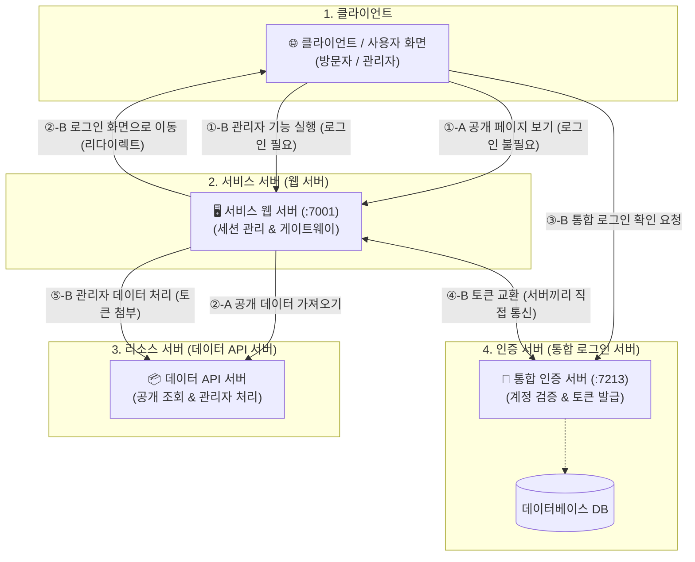
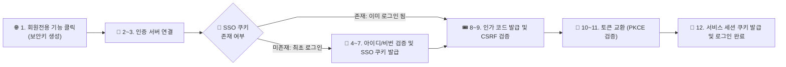
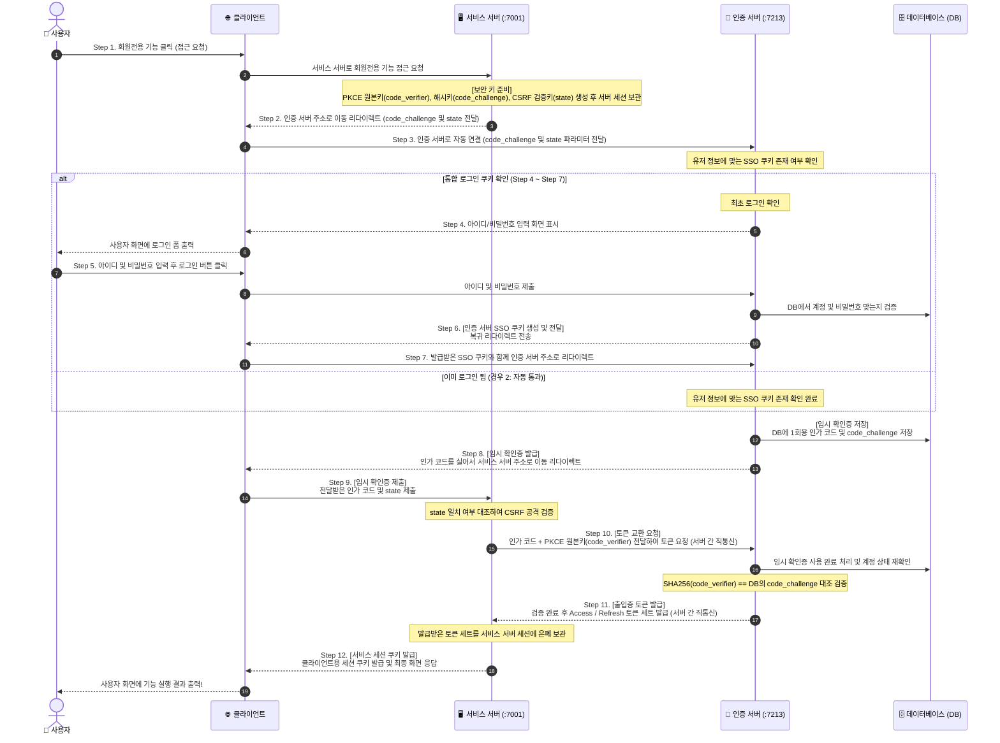
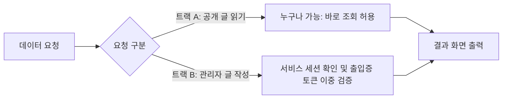
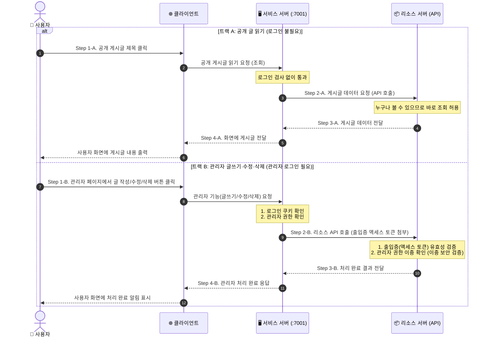

# SSO 통합 인증 발급 코드·토큰·쿠키 역할 및 파이프라인 명세서

> **문서 목적**: 본 명세서는 사내 OIDC(OpenID Connect) 기반 SSO(Single Sign-On) 인증 및 인가 시스템 구축 시 발생하는 **모든 발급 코드, 토큰, 쿠키, 파라미터의 세부 명세(발급 주체, 보관 위치, 수명, 데이터 구조, 보안 방어 목적)와 컴포넌트 역할, 2-Track 파이프라인**을 완벽하게 정의한다.
> 
> **기준 참조 및 구현**:
> - [AuthServer README.md](file:///C:/NSquareHomepage/nsq_auth/README.md) (.NET 10 + OpenIddict 6 / MariaDB)
> - [OIDC 도입 보고서.md](file:///C:/NSquareHomepage/nsq_auth/docs/OIDC-%EB%8F%84%EC%9E%85-%EB%B3%B4%EA%B3%A0%EC%84%9C.md)
> - [SSO 보안 심층 명세서 (sso_deep_specification.md)](file:///C:/NSquareHomepage/sso_deep_specification.md) (state, PKCE, XSS/CSRF 방어 메커니즘 상세)

---

## 1. 시스템 컴포넌트 및 계층별 역할 정의 (System Architecture)

본 시스템은 Zero-Trust 보안 원칙에 따라 4개의 주요 컴포넌트로 역할을 엄격히 분리한다.

### 1.1 컴포넌트별 상세 역할

| 컴포넌트 | 성격 | 주요 역할 및 자격증명 데이터 취급 | 비고 |
|---|---|---|---|
| **1. 클라이언트** | 사용자 인터페이스 (Client / UI) | • 사용자 클라이언트 화면 렌더링 및 HTTP 요청 전달 • 302 리다이렉트 자동 수행 • **토큰(`Access/Refresh Token`)을 절대 소유/접근하지 않음** (XSS 원천 차단) • 인증 서버 SSO 쿠키 및 서비스 세션 쿠키만 전송 | 방문자 / 관리자 공통 |
| **2. 서비스 서버** | 세션 관리자 & 게이트웨이 | • Back-channel로 토큰 교환 및 서버 세션에 토큰 은폐 보관 • 클라이언트에 `HttpOnly` 서비스 세션 쿠키 발급 및 검증 • **공개 GET 요청**: 로그인 세션 검사 없이 리소스 서버 API 대행 호출 • **관리자 CUD 요청**: `Role == Admin` 검증 후 리소스 서버 API 대행 호출 | 백엔드 웹 서버 (예: `:7001`) |
| **3. 리소스 서버** | 자원 관리자 (Resource API) | • 서비스 서버로부터 전달받은 `Authorization: Bearer <access_token>` 검증 • **공개 GET 요청**: 토큰 서명만 확인하거나 인증 없이 조회 허용 • **관리자 CUD 요청**: JWT 클레임 내 `Role == Admin` 및 서명/만료 독자 검증 (Zero-Trust) | 데이터 API 서버 |
| **4. 인증 서버** | 신원 및 인가 서버 (IdP) | • 사용자 계정 관리 및 비밀번호 해시 검증 (`PasswordHasher<User>`) • SSO 세션 쿠키 발급 및 관리 • OIDC 엔드포인트 (`/connect/authorize`, `/connect/token` 등) 제공 • PKCE 원사이드 검증 (`code_challenge` 대조), 인가 코드 및 OIDC 토큰 세트 발급 | 본 저장소 (`AuthServer` :7213) |

### 1.2 서버-to-유저(세션) vs 서버-to-서버(JWT) 이중 인증 구조 채택 사유 (Architectural Rationale)

본 아키텍처는 **"클라이언트 영역은 세션 방식"**, **"서버 간(Back-channel/Resource API) 통신 영역은 JWT 방식"**을 엄격히 분리하여 사용한다. 각 영역별 기술 채택 사유는 다음과 같다.

#### 1) 서버-to-유저 (클라이언트 ↔ 서비스 서버): 세션 방식 (`HttpOnly` 세션 쿠키) 채택 사유
- **XSS 공격 원천 차단**: 클라이언트의 `LocalStorage`나 JavaScript 메모리에 JWT 토큰(`Access/Refresh Token`)을 보관하면 XSS(Cross-Site Scripting) 공격 발생 시 토큰이 직접 탈취될 위험이 존재한다. 자바스크립트 접근이 전면 금지된 `HttpOnly` 세션 쿠키를 사용함으로써 클라이언트 내 토큰 노출 위험을 근본적으로 차단한다.
- **자격증명 은폐**: 클라이언트에는 세션 ID 쿠키만 내어주고 실제 리소스 접근 권한을 가진 JWT 토큰 세트는 서비스 서버 백엔드 세션 메모리에 은폐 보관한다.
- **즉각적인 세션 제어권**: 사용자의 로그아웃, 클라이언트 종료, 계정 강제 정지/권한 강등 시 서비스 서버 세션을 즉시 파기하여 접속을 실시간으로 차단할 수 있다 (Stateful 관리).

#### 2) 서버-to-서버 (서비스 서버 ↔ 리소스 API 서버): JWT 방식 (`Bearer Token`) 채택 사유
- **Stateless 고성능 검증 (DB/네트워크 병목 제거)**: 서버 간 통신은 수많은 API 호출이 발생하는 고부하 구간이다. 세션 방식을 쓸 경우 리소스 API 서버가 매 요청마다 중앙 세션 DB/Redis를 동기 조회하는 병목이 발생하지만, JWT 방식을 사용하면 리소스 API 서버가 **DB 조회 없이 자체 메모리상에서 서명(Signature)과 만료 시간만 즉시 검증**하므로 처리 성능(TPS)이 극대화된다.
- **수평 확장성 (Scale-out) 및 MSA 독립성**: 데이터 API 서버, 결제 서버, 게시판 서버 등 백엔드 마이크로서비스가 늘어나더라도 중앙 세션 DB를 공유할 필요 없이, 동일한 서명 검증 로직만으로 독립적인 스케일아웃 및 서버리스 배치가 가능하다.
- **Zero-Trust 이중 인가 (Self-contained Claims)**: 리소스 API 서버는 백엔드 사설 네트워크 내에서도 Zero-Trust 원칙에 따라 사용자 자격증명을 검증해야 한다. JWT 내부에는 서명된 사용자 식별 정보와 역할(`role: Admin`)이 클레임 형태로 자체 포함되어 있어, 추가 DB 조회 없이 요청자의 관리자 권한을 즉시 판단할 수 있다.

---

## 2. SSO 인증 발급 코드·토큰·쿠키 상세 명세 (8대 자격증명)

SSO 인증 및 인가 파이프라인에서 생성, 발급, 교환, 검증되는 **8가지 핵심 코드, 토큰, 쿠키, 파라미터**의 정밀 명세이다.

### 2.1 자격증명 종합 명세표

| 구분 | 발급/생성 주체 | 보관/전송 위치 | 수명 | 형태 및 데이터 규격 | 역할 및 보안 방어 목적 |
|---|---|---|---|---|---|
| **1. PKCE `code_verifier`** | 서비스 서버 | 서비스 서버 세션 | 일회성 (토큰 교환 시 소멸) | 43~128자 Cryptographic Random String | **인가 코드 탈취 공격 방어 (RFC 7636)**. 네트워크 및 클라이언트에 절대 노출 안 됨 |
| **2. PKCE `code_challenge`** | 서비스 서버 | 인증 서버 DB (`OpenIddictTokens`) | 인가 코드 수명과 동일 (1분) | `BASE64URL(SHA256(verifier))` | 인증 서버가 `/connect/token` 요청 시 제출된 `code_verifier` 검증용 키 |
| **3. `state` 파라미터** | 서비스 서버 | 서비스 세션 & URL | 일회성 | Cryptographic Random GUID / String | **CSRF (사이트 간 요청 위조) 공격 방어**. 콜백 요청이 자기가 시작한 요청인지 대조 |
| **4. SSO 쿠키** (`AuthServer_SSO_Cookie`) | 인증 서버 | 클라이언트 (인증 서버 도메인 `:7213`) | **14일** (Sliding Expiration) | Data Protection 암호화/서명 쿠키 (`HttpOnly`, `Secure`, `SameSite=Lax`) | **인증 서버 로그인 증명 (SSO의 실체)**. 유효 시 로그인 화면(`/login`) 생략 통과 |
| **5. 인가 코드** (`Authorization Code`) | 인증 서버 | DB 및 클라이언트 302 Query String | **1분** (단수명, 1회용) | 복호화 가능한 암호화 티켓 문자열 | **토큰 교환용 일회성 임시 티켓**. `/connect/token` 교환 성공 시 `redeemed` 처리 |
| **6. 서비스 세션 쿠키** | 서비스 서버 | 클라이언트 (서비스 도메인 `:7001`) | 서비스 설정 세션 수명 | 암호화된 세션 ID 쿠키 (`HttpOnly`, `Secure`, `SameSite=Lax`) | 서버 보관 토큰과 1:1 매핑. 자바스크립트에 토큰 미노출로 XSS 방어 |
| **7. Access Token** | 인증 서버 | 서비스 서버 세션/메모리 | **15분** (단수명) | JWT (`sub`, `name`, `email`, `role`, `scope`, `exp`) | **리소스 서버 API 호출 및 신원 확인용 자격증명 (`Bearer`)**. 짧은 수명으로 탈취 피해 극소화 |
| **8. Refresh Token** | 인증 서버 | 서비스 서버 세션 & 인증 서버 DB | **14일** | 불투명한 암호화 문자열 (Opaque Token) | **Access Token 백그라운드 무자각 갱신용**. 갱신 시마다 DB에서 유저/계정 존재 재확인 |

---

### 2.2 핵심 자격증명 세부 설명 및 검증 메커니즘

#### ① PKCE 쌍 (`code_verifier` & `code_challenge`)
- **원리**: 인가 코드(`code`)는 클라이언트 URL(302 리다이렉트)을 타고 전달되므로 네트워크/히스토리 상에서 탈취될 수 있다.
- **방어**: 클라이언트는 처음에 `code_verifier`를 만들어 세션에 숨겨 두고, 그 해시값인 `code_challenge`만 인증 서버로 전송한다. 인증 서버는 인가 코드를 DB에 기록할 때 `code_challenge`를 묶어둔다. 토큰 교환 시 클라이언트가 제출한 원본 `code_verifier`의 SHA-256 해시가 일치하지 않으면 토큰 발급을 거부한다 (`invalid_grant`).
- **서버 정책**: `AuthServer`는 `RequireProofKeyForCodeExchange` 설정을 통해 PKCE 사용을 **전역 강제**한다.

#### ② 인증 서버 SSO 쿠키 vs 서비스 세션 쿠키
- **SSO 쿠키 (`:7213`)**: 인증 서버 도메인에 묶이며, 암호화된 `NameIdentifier`(User.Id), `Name`, `Role` 클레임이 포함되어 있다. 사내 모든 서비스(홈페이지, 위키, 그룹웨어 등)가 로그인 시 인증 서버를 거칠 때 이 쿠키를 공유하여 **"단 1회 로그인으로 모든 서비스 이용"**을 가능케 한다.
- **서비스 세션 쿠키 (`:7001`)**: 각 서비스 도메인에 국한된다. 서비스 서버는 인증 서버로부터 받은 Access/Refresh Token을 메모리/세션에 보관하고, 클라이언트에는 자바스크립트가 접근 불가능한 `HttpOnly` 서비스 세션 쿠키만 내어준다.
- **XSS 방어 효과**: 클라이언트(LocalStorage/Memory)에 JWT 토큰을 저장하지 않으므로, XSS 공격이 발생하더라도 해커가 Refresh Token이나 Access Token을 훔쳐갈 수 없다.

#### ③ `state` 파라미터 (CSRF / 사이트 간 요청 위조 방어)
- **위협 시나리오 (Login CSRF)**: 공격자가 자신이 받은 인가 코드가 실린 악성 콜백 URL(`?code=attacker_code`)을 피해자가 클릭하도록 유도하여, 피해자의 클라이언트 세션을 공격자의 계정에 강제로 로그인시키는 공격.
- **방어 메커니즘**: 서비스 서버는 로그인 요청을 시작할 때 난수 `state`(GUID)를 생성하여 **자신의 서버 세션에 저장**하고 인증 서버로 전송한다. 콜백 리다이렉트 시 전달받은 `state` 파라미터가 자신의 세션에 저장된 `state`와 1:1로 일치하는지 대조한다. 일치하지 않으면 제3자에 의해 주입된 위조 요청으로 판단하여 즉시 차단한다.

---

## 3. [파이프라인 1] SSO 로그인 및 토큰 발급 파이프라인 (Step 1 ~ Step 12)

관리자/회원 기능 진입 시 인증 서버와 통신하여 **SSO 쿠키 검증, 비밀번호 검증, PKCE 대조, 토큰 교환 및 서비스 세션 쿠키 발급**을 완료하는 전체 흐름이다.

### 3.1 SSO 로그인 요약 순서도 (`graph LR`)

Step 1부터 Step 12까지의 핵심 파이프라인 흐름을 가로 방향으로 간결하게 요약한 순서도이다.

---

### 3.2 로그인 시퀀스 상세 다이어그램 (`sequenceDiagram`)

---

### 3.3 Step 1 ~ Step 12 단계별 세부 데이터 이동 및 파이프라인 명세

시퀀스 다이어그램 각 단계별로 실제 이동하는 **데이터 구조, 파라미터 값, 발급/생성 주체, 보관/검증 로직**에 대한 상세 명세이다.

#### 📌 [Step 1] 클라이언트 → 서비스 서버: 보호된 기능 접근 요청
- **이동 자료**: 쿠키 및 파라미터가 없는 표준 HTTP GET 요청 (`GET /admin/manage`)
- **생성 및 발급 자료**:
  - **`code_verifier`**: 서비스 서버가 생성하는 43~128자 암호학적 무작위 난수 문자열 (서버 세션에 보관)
  - **`code_challenge`**: `BASE64URL(SHA256(code_verifier))` 공식을 통해 산출한 해시 키
  - **`state`**: CSRF(사이트 간 요청 위조) 방지용 Cryptographic Random GUID
- **보관 위치**: 서비스 서버의 백엔드 세션 메모리

#### 📌 [Step 2] 서비스 서버 → 클라이언트: 인증 서버 인가 주소로 리다이렉트 전송 (보안 키 전달)
- **이동 자료**: `302 Found` HTTP 응답 및 `Location` 헤더
- **생성 및 전달되는 무작위 보안 키 상세**:
  1. **`code_verifier`** *(비밀키)*: PKCE 원본 무작위 난수 (외부에 절대 노출 안 됨, 서비스 서버 세션 보관)
  2. **`code_challenge`** *(공개 해시키)*: `BASE64URL(SHA256(code_verifier))` 해시값 (인증 서버에 전달)
  3. **`state`** *(CSRF 검증키)*: 무작위 GUID 난수 (인증 서버 전달 및 서비스 서버 세션 보관)
- **전달 URL 및 파라미터 명세**:
  - `Location: https://localhost:7213/connect/authorize`
  - `?client_id=company-homepage` *(서비스 식별자)*
  - `&redirect_uri=https://localhost:7001/signin-oidc` *(콜백 수신 주소)*
  - `&response_type=code` *(OIDC Authorization Code Flow 지정)*
  - `&scope=openid profile email offline_access` *(요청 권한 범위)*
  - `&code_challenge=<HASH>&code_challenge_method=S256` *(PKCE 해시 키)*
  - `&state=<STATE>` *(CSRF 방어 검증 키)*

#### 📌 [Step 3] 클라이언트 → 인증 서버: 발급받은 인증 주소로 접근
- **이동 자료**: Step 2에서 전달받은 `Location` URL 전체 및 클라이언트 헤더
- **쿠키 포함 여부**: 기존에 발급받은 `AuthServer_SSO_Cookie`가 클라이언트에 존재하면 함께 전송됨
- **인증 서버 처리 로직**:
  - `client_id` 존재 및 `redirect_uri` 사전 등록 화이트리스트 대조
  - 요청에 유효한 SSO 쿠키가 동봉되었는지 확인 (유효 시 유저 정보에 맞는 SSO 쿠키 존재 확인 후 Step 8로 즉시 진행)

#### 📌 [Step 4] 인증 서버 → 클라이언트: 로그인 폼 주소로 리다이렉트 전송 (SSO 쿠키 미존재 시)
- **이동 자료**: `302 Found` HTTP 응답 (`Location: https://localhost:7213/login`)
- **실행 조건**: 클라이언트에 유효한 `AuthServer_SSO_Cookie`가 없는 경우 (최초 로그인)
- **비고**: 이미 유효한 SSO 쿠키를 보유한 경우 유저 정보에 맞는 SSO 쿠키 존재가 확인되어 즉시 Step 8로 통과함

#### 📌 [Step 5] 클라이언트 → 인증 서버: 사용자 인증 정보 제출
- **이동 자료**: `POST /login` (`Content-Type: application/x-www-form-urlencoded`)
- **제출 페이로드**: `Input.Email=test@company.local&Input.Password=Test1234!`
- **인증 서버 처리 로직**:
  - MariaDB `AspNetUsers` 테이블에서 유저 조회
  - `PasswordHasher<User>` (PBKDF2 알고리즘)로 입력된 비밀번호 대조
  - `LoginAudit` 테이블에 접속 성공/실패 시도 이력을 기록함

#### 📌 [Step 6] 인증 서버 → 클라이언트: 인증 서버 SSO 쿠키 생성 및 전달, 복귀 리다이렉트 전송
- **인증 서버 자체 처리 로직**:
  - 사용자 인증 성공 시 인증 서버(`:7213`) 자체 내부에서 `AuthServer_SSO_Cookie`를 직접 암호화 생성/발급함
  - 클레임 보관 데이터: User ID(`sub`), 이름(`name`), 역할(`role`)
- **이동 및 전송 자료**:
  - `302 Found` HTTP 응답 (`Location: /connect/authorize?...` - 당초 요청했던 인가 주소로 복귀)
  - `Set-Cookie: AuthServer_SSO_Cookie=...` *(인증 서버 자체 발급 SSO 쿠키를 HTTP 응답 헤더에 동봉하여 전송)*

#### 📌 [Step 7] 클라이언트 → 인증 서버: 발급받은 SSO 쿠키와 함께 인증 서버 주소로 리다이렉트
- **이동 자료**: Step 6에서 발급받은 `AuthServer_SSO_Cookie`가 포함된 `GET /connect/authorize?...`
- **인증 서버 처리 로직**: SSO 쿠키를 복호화하여 유저가 인증 완료 상태임을 확인하고 로그인 화면 생략 처리

#### 📌 [Step 8] 인증 서버 → 클라이언트: 인가 코드 발급 및 서비스 주소로 리다이렉트 전송
- **발급 및 DB 저장 자료**:
  - **`Authorization Code` (인가 코드)**: `splat_10429...` 형태의 1회용 복호화 가능 암호화 티켓 (수명 1분)
  - **DB 저장**: MariaDB `OpenIddictTokens` 테이블에 인가 코드와 함께 Step 3에서 받은 `code_challenge`를 묶어 저장
- **응답 규격**: `302 Found`
- **Location 전달 파라미터**: `https://localhost:7001/signin-oidc?code=splat_10429...&state=<STATE>`

#### 📌 [Step 9] 클라이언트 → 서비스 서버: 발급받은 인가 코드로 서비스 콜백 주소 접근
- **이동 자료**: `GET /signin-oidc?code=splat_10429...&state=<STATE>`
- **서비스 서버 보안 검증 로직**:
  - 전달받은 `state` 파라미터와 Step 1에서 서버 세션에 저장해둔 `state` 값을 1:1 대조
  - 일치하지 않을 경우 CSRF 공격으로 판단하고 즉시 요청 거부

#### 📌 [Step 10] 서비스 서버 → 인증 서버: 인가 코드 및 PKCE 원본 키 전달 (Back-channel 토큰 요청)
- **이동 자료**: `POST /connect/token` (`Content-Type: application/x-www-form-urlencoded`) *(서버 대 서버 직접 통신, 클라이언트 거치지 않음)*
- **전송 Body 페이로드**:
  - `grant_type=authorization_code`
  - `client_id=company-homepage`
  - `redirect_uri=https://localhost:7001/signin-oidc`
  - `code=splat_10429...` *(Step 8에서 발급받은 인가 코드)*
  - `code_verifier=<ORIGINAL_VERIFIER>` *(Step 1에서 세션에 보관해둔 원본 키)*

#### 📌 [Step 11] 인증 서버 → 서비스 서버: OIDC 토큰 세트 발급 (Back-channel 응답)
- **인증 서버 검증 및 처리 로직**:
  1. 인가 코드 1회성 사용 여부(`redeemed`) 확인 및 사용 처리
  2. MariaDB 유저 존재 및 계정 활성 상태 재확인
  3. **PKCE 원본 키 검증**: 전달받은 `code_verifier`를 SHA-256 해시하여 DB에 저장된 `code_challenge`와 1:1 일치 여부 검증
- **발급 및 이동 자료 (JSON Response)**:
  - **`access_token`**: JWT (`sub`, `name`, `email`, `role`, `scope`, `exp`), 수명 15분 (단수명)
  - **`refresh_token`**: 불투명한 암호화 문자열 (Opaque Token), DB 매핑, 수명 14일
- **서비스 서버 처리 로직**:
  - 발급받은 토큰 세트를 서비스 서버 세션 메모리에 은폐 보관

#### 📌 [Step 12] 서비스 서버 → 클라이언트: 서비스 세션 쿠키 발급 및 최종 응답
- **발급 및 이동 자료**:
  - **`Service_Session_Cookie`**: 서비스 서버 도메인(`:7001`)용 암호화 세션 ID 쿠키 (`HttpOnly`, `Secure`, `SameSite=Lax`)
- **보안 목적**: 클라이언트에는 자바스크립트가 접근 불가능한 서비스 세션 쿠키만 전달하고 실제 토큰(`Access/Refresh Token`)은 서버에만 저장하여 **XSS 공격 시 토큰 탈취를 원천 차단**함

---

### 3.4 Step 1 ~ Step 12 페이로드 및 파이프라인 명세표

| 단계 | 주체 | HTTP 요청/응답 규격 | 주요 데이터 Payload 및 처리 로직 |
|---|---|---|---|
| **Step 1** | 클라이언트 → 서비스 서버 | `GET /admin/manage` | **요청**: 세션 쿠키 없음. **로직**: 서비스 서버가 `code_verifier`(43~128자 무작위 문자열), `state`(CSRF 방어용 GUID)를 생성하여 **서버 세션에 보관**. `code_challenge = BASE64URL(SHA256(code_verifier))` 계산. |
| **Step 2** | 서비스 서버 → 클라이언트 | `302 Found` `Location: https://localhost:7213/connect/authorize?...` | **Location 파라미터**: • `client_id=company-homepage` • `redirect_uri=https://localhost:7001/signin-oidc` • `response_type=code` • `scope=openid profile email offline_access` • `code_challenge=<HASH>&code_challenge_method=S256` • `state=<STATE>` |
| **Step 3** | 클라이언트 → 인증 서버 | `GET /connect/authorize?...` | **Cookie**: `AuthServer_SSO_Cookie` (존재할 수도 있고 없을 수도 있음) **로직**: 인증 서버는 `code_challenge` 및 `redirect_uri` 화이트리스트 검증 후 SSO 쿠키 존재 여부를 판별함. |
| **Step 4** | 인증 서버 → 클라이언트 | `302 Found` `Location: /login` | *(SSO 쿠키 없을 시)* 유효한 SSO 쿠키가 없으므로 아이디/비밀번호 입력 폼(`/login`)으로 리다이렉트함. *(유효 쿠키 존재 시 유저 정보에 맞는 SSO 쿠키 존재 확인 후 Step 8로 통과)* |
| **Step 5** | 클라이언트 → 인증 서버 | `POST /login` `Content-Type: application/x-www-form-urlencoded` | **Body Payload**: `Input.Email=test@company.local&Input.Password=Test1234!` **로직**: 인증 서버가 `PasswordHasher<User>`로 PBKDF2 해시를 대조하고 `LoginAudit` 테이블에 접속 성공/실패 시도 이력을 기록함. |
| **Step 6** | 인증 서버 → 클라이언트 | `302 Found` `Set-Cookie: AuthServer_SSO_Cookie=...` | **Set-Cookie**: 인증 서버 자체 내부에서 `AuthServer_SSO_Cookie`를 암호화 발급하고, HTTP 응답 헤더에 동봉하여 이전 요청 주소로 복귀 리다이렉트 전송. |
| **Step 7** | 클라이언트 → 인증 서버 | `GET /connect/authorize?...` | **Cookie**: `AuthServer_SSO_Cookie` (Step 6에서 발급받은 유효 쿠키 전송). **로직**: 인증 서버가 쿠키 복호화 후 유저 로그인 상태임을 확인. |
| **Step 8** | 인증 서버 → 클라이언트 | `302 Found` `Location: https://localhost:7001/signin-oidc?code=...&state=...` | **로직**: DB `OpenIddictTokens`에 1회용 인가 코드(`code`)와 `code_challenge`를 저장함 (수명 1분). **Location Query**: `code=splat_10429...&state=<STATE>` |
| **Step 9** | 클라이언트 → 서비스 서버 | `GET /signin-oidc?code=...&state=...` | **Query**: `code=splat_10429...&state=<STATE>` **로직**: 서비스 서버가 전달받은 `state`가 Step 1에서 세션에 저장한 `state`와 일치하는지 CSRF 검증. |
| **Step 10** | 서비스 서버 → 인증 서버 | `POST /connect/token` *(Back-channel)* `Content-Type: application/x-www-form-urlencoded` | **Body Payload** *(서버 대 서버 통신)*: • `grant_type=authorization_code` • `client_id=company-homepage` • `redirect_uri=https://localhost:7001/signin-oidc` • `code=splat_10429...` • `code_verifier=<ORIGINAL_VERIFIER>` *(세션 보관 원본 제출)* |
| **Step 11** | 인증 서버 → 서비스 서버 | `200 OK` *(Back-channel 응답)* `Content-Type: application/json` | **JSON Payload**: `{`  &nbsp;&nbsp;`"access_token": "eyJhbGci...",` *(15분)* &nbsp;&nbsp;`"token_type": "Bearer",` &nbsp;&nbsp;`"expires_in": 900,` &nbsp;&nbsp;`"refresh_token": "rt_88012..."` *(14일)* `}` **검증**: `SHA256(code_verifier) == code_challenge` 대조, 코드를 `redeemed` 처리 및 DB 유저 재확인. |
| **Step 12** | 서비스 서버 → 클라이언트 | `200 OK` (또는 302) `Set-Cookie: Service_Session_Cookie=...` | **로직**: 수신한 토큰 묶음을 서버 보안 세션에 저장. **Set-Cookie**: `Service_Session_Cookie` (`HttpOnly`, `Secure`, `SameSite=Lax`). 토큰이 클라이언트로 나가지 않음. |

---

## 4. [파이프라인 2] 리소스 데이터 CRUD 파이프라인

로그인 완료 후 서비스 이용 시 **[트랙 A: 로그인 불필요 GET 정보 조회]**와 **[트랙 B: 관리자 전용 CUD 생성/수정/삭제]**로 분리된 처리 파이프라인이다.

### 4.1 CRUD 파이프라인 요약 순서도 (`graph LR`)

공개 조회(트랙 A)와 관리자 CUD(트랙 B)의 분기 및 처리 흐름을 간결하게 개념화한 블록 순서도이다.

---

### 4.2 CRUD 파이프라인 통합 시퀀스 다이어그램 (`sequenceDiagram`)

---

### 4.3 CRUD 파이프라인 명세표

| 트랙 및 단계 | 주체 | HTTP 요청/응답 규격 | 데이터 Payload 및 상세 검증 로직 |
|---|---|---|---|
| **Step 1-A** | 클라이언트 → 서비스 서버 | `GET /resources/1042` | **요청**: 로그인 세션 쿠키 없음 (익명 방문자). **로직**: 서비스 서버는 로그인 여부나 세션 쿠키를 요구하지 않고 요청을 즉시 통과시킴. |
| **Step 2-A** | 서비스 서버 → 리소스 서버 | `GET /api/resources/1042` | **요청**: 서비스 서버가 리소스 API 호출. **로직**: 리소스 서버는 공개 엔드포인트에 대해 인증 헤더 없이 데이터를 제공함. |
| **Step 3-A~4-A** | 리소스 서버 → 클라이언트 | `200 OK` | **JSON Payload**: `{ "id": 1042, "title": "공지사항", "content": "..." }` 데이터를 클라이언트에 최종 반환. |
| **Step 1-B** | 클라이언트 → 서비스 서버 | `POST /admin/resources` `PUT /admin/resources/1042` `DELETE /admin/resources/1042` | **Cookie**: `Service_Session_Cookie` **Body**: `{ "title": "신규 등록", "content": "..." }` **로직**: 1. 세션 쿠키 유효성 확인, 2. 서버 세션에 저장된 사용자 역할이 `Role == Admin`인지 인가 검증 (관리자가 아니면 403 Forbidden). |
| **Step 2-B** | 서비스 서버 → 리소스 서버 | `POST/PUT/DELETE /api/resources` `Authorization: Bearer <access_token>` | **Header**: `Authorization: Bearer eyJhbGci...` (서비스 서버가 세션에 보관 중인 15분 수명 Access Token 실어서 전송). **로직**: 1. Access Token JWT 서명(인증 서버 공개키) 및 만료 검증, 2. JWT 클레임 내 `role == "Admin"` 유무를 독자적으로 재검증 (**Zero-Trust 이중 인가**). |
| **Step 3-B~4-B** | 리소스 서버 → 클라이언트 | `200 OK` 또는 `201 Created` | **JSON Payload**: `{ "success": true, "resourceId": 1042, "action": "UPDATED" }` 처리 결과를 관리자 화면에 반환. |

---

## 5. 보안 응급 상황 대응 및 갱신 메커니즘 (Security Safeguards)

> 💡 **상세 보안 공격 방어 원리 및 시퀀스**: `state`(CSRF), PKCE, XSS 방어 및 Zero-Trust 세부 아키텍처에 대한 상세 명세는 **[sso_deep_specification.md](file:///C:/NSquareHomepage/sso_deep_specification.md)** 문서를 참조한다.

| 위협 시나리오 | 파이프라인 차원 대응 메커니즘 | 관련 발급 자격증명 |
|---|---|---|
| **1. Authorization Code 탈취** | • 1분 단수명 및 1회용 (`redeemed` 상태 추적) • `code_verifier` 없이는 토큰 교환 불가능 (PKCE) • 등록된 `RedirectUris` 화이트리스트 주소 외 리다이렉트 거부 | `Authorization Code` `code_verifier` `code_challenge` |
| **2. XSS (스크립트 해킹) 공격** | • 클라이언트 자바스크립트에 JWT 토큰(`Access/Refresh Token`)을 전혀 노출하지 않음 • `HttpOnly`, `Secure`, `SameSite=Lax` 쿠키로만 세션 관리 | `서비스 세션 쿠키` `SSO 쿠키` |
| **3. Access Token 탈취 피해** | • Access Token 수명을 **15분**으로 극단적 단수명 설정하여 유효 기간 최소화 • Refresh Token 갱신 시 매번 DB에서 사용자 존재 및 계정 정지 여부 재확인 | `Access Token` `Refresh Token` |
| **4. CSRF (사이트 간 요청 위조)** | • 로그인 시 요청마다 고유 `state` 파라미터 생성 및 대조 • API 요청 시 `SameSite=Lax` 속성 적용 | `state` 파라미터 |
| **5. 관리자 권한 강등/탈퇴자 갱신** | • 역할 변경(`PUT /api/users/{id}/role`) 시 쿠키 클레임을 신뢰하지 않고 DB의 현재 역할 실시간 조회 • 토큰 갱신 시 DB 유저 상태 재확인 후 차단 | `Role` 클레임 `Refresh Token` |

---
*문서 작성 기준: `AuthServer` (.NET 10 / OpenIddict 6 / MariaDB 12.2)*
